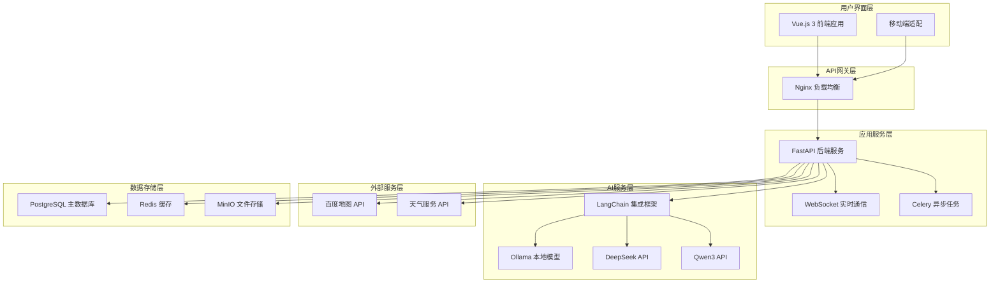
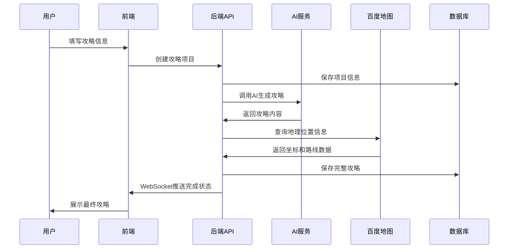

# 基于GenAI的旅游攻略生成器 - 项目概述

## 📋 项目背景

基于您现有的优秀旅游攻略模板系统，我们设计了一个全新的基于GenAI的web应用，将手动创建攻略的过程自动化和智能化。该项目充分利用了现有模板的结构化设计，通过大语言模型的能力，为用户提供专业级的旅游攻略生成服务。

## 🎯 项目目标

### 主要目标
- **效率革命**：将原本需要数小时的攻略制作缩短为几分钟
- **质量保证**：基于成熟模板确保生成内容的专业性和实用性
- **智能化升级**：集成AI技术提供个性化推荐
- **用户体验**：提供现代化、直观的web界面

### 技术目标
- 构建可扩展的GenAI应用架构
- 支持多种大模型的灵活切换
- 实现高效的缓存和性能优化
- 建立完善的监控和运维体系

## 🏗️ 技术架构概览

## 🔄 工作流程

### 用户交互流程
1. **信息输入**：用户填写旅游基本信息（目的地、天数、偏好等）
2. **AI模型选择**：用户选择使用的AI服务（Ollama/DeepSeek/阿里云百炼）
3. **攻略生成**：系统调用AI服务生成结构化攻略内容
4. **实时反馈**：通过WebSocket实时显示生成进度
5. **内容完善**：调用百度地图API补充准确的地理位置信息
6. **结果展示**：展示完整的攻略内容，支持在线编辑
7. **多格式导出**：支持Markdown、HTML、PDF格式导出

### 技术处理流程

## 📊 核心功能模块

### 1. 用户管理模块
- **用户注册/登录**：支持邮箱注册，JWT认证
- **权限管理**：游客、注册用户、高级用户三级权限
- **偏好设置**：保存用户的旅游偏好和历史记录

### 2. 攻略生成模块
- **智能生成引擎**：基于LangChain的AI生成核心
- **模板管理**：维护和更新攻略模板
- **内容优化**：自动优化和校验生成内容

### 3. 地理位置模块
- **地点搜索**：集成百度地图的POI搜索
- **路线规划**：自动计算最优路线和时间
- **实时信息**：获取交通、天气等实时信息

### 4. 内容管理模块
- **攻略存储**：支持攻略的保存、编辑、删除
- **版本控制**：记录攻略的修改历史
- **分享协作**：支持攻略分享和多人协作编辑

### 5. 导出服务模块
- **多格式支持**：Markdown、HTML、PDF格式导出
- **自定义样式**：支持不同的导出模板
- **批量处理**：支持批量导出多个攻略

## 🚀 技术栈详情

### 前端技术
- **Vue.js 3**: 现代化前端框架，组合式API
- **TypeScript**: 类型安全，提高代码质量
- **Element Plus**: 专业UI组件库
- **Vite**: 快速构建工具
- **Pinia**: 状态管理
- **Axios**: HTTP客户端

### 后端技术
- **FastAPI**: 高性能异步Web框架
- **LangChain**: AI应用开发框架
- **SQLAlchemy**: ORM数据库操作
- **Celery**: 分布式任务队列
- **Redis**: 缓存和会话存储
- **PostgreSQL**: 关系型数据库

### AI服务
- **Ollama**: 本地部署的开源大模型
- **DeepSeek**: 商业化AI服务
- **阿里云百炼**: 阿里云百炼大模型服务平台
- **智能调度**: 自动选择最优模型

### 基础设施
- **Docker**: 容器化部署
- **Nginx**: 反向代理和负载均衡
- **MinIO**: 对象存储服务
- **Prometheus**: 监控和指标收集

## 📈 性能指标

### 目标性能指标
- **响应时间**: API响应 < 2秒
- **生成时间**: 攻略生成 < 30秒
- **并发用户**: 支持100+并发
- **可用性**: 99.5%服务可用性
- **缓存命中率**: > 80%

### 优化策略
- **多级缓存**: 浏览器 → CDN → Nginx → Redis → 数据库
- **异步处理**: 使用Celery处理耗时任务
- **数据库优化**: 索引优化、连接池配置
- **AI缓存**: 缓存常见的AI响应结果

## 🔒 安全设计

### 认证授权
- **JWT Token**: 无状态认证机制
- **权限控制**: 基于角色的访问控制(RBAC)
- **API安全**: 请求限流、参数验证

### 数据安全
- **加密存储**: 敏感数据加密存储
- **传输安全**: HTTPS加密传输
- **输入验证**: 严格的输入参数验证

### 运维安全
- **日志监控**: 完整的操作日志记录
- **异常处理**: 优雅的错误处理机制
- **备份恢复**: 定期数据备份

## 💰 成本分析

### 开发成本
- **人力成本**: 3-5人团队，8-12周开发周期
- **技术成本**: 开源技术为主，降低技术门槛
- **部署成本**: 容器化部署，便于扩展

### 运营成本
- **基础设施**: 服务器、存储、网络费用
- **AI服务**: 商业模型API调用费用
- **第三方服务**: 百度地图API等外部服务费用

### 成本优化
- **本地模型**: 优先使用Ollama降低AI调用成本
- **缓存策略**: 减少重复的API调用
- **自动伸缩**: 根据负载动态调整资源

## 🔮 发展规划

### Phase 1: MVP版本 (1-2个月)
- 基础攻略生成功能
- 单一AI模型支持
- 基本的Web界面
- 核心API开发

### Phase 2: 功能完善 (2-3个月)
- 多AI模型支持
- 百度地图集成
- 用户管理系统
- 攻略编辑功能

### Phase 3: 高级特性 (3-4个月)
- 实时协作编辑
- 移动端适配
- 高级导出功能
- 性能优化

### Phase 4: 商业化 (4-6个月)
- 用户权限分级
- 高级AI模型接入
- 企业级功能
- API开放平台

## 🎯 成功指标

### 技术指标
- ✅ 攻略生成成功率 > 95%
- ✅ 平均响应时间 < 2秒
- ✅ 系统可用性 > 99.5%
- ✅ 用户满意度 > 4.5/5

### 业务指标
- 📈 月活跃用户增长 > 20%
- 📈 攻略生成完成率 > 90%
- 📈 用户留存率 > 60%
- 📈 内容质量评分 > 4.0/5

## 🎉 项目亮点

### 创新性
- **模板与AI结合**: 将成熟的攻略模板与AI生成能力完美结合
- **多模型支持**: 支持本地和云端多种AI模型
- **实时地理数据**: 集成百度地图API提供准确的位置信息

### 实用性
- **专业质量**: 基于经验丰富的旅游攻略模板
- **个性化**: 根据用户偏好生成定制化内容
- **多格式输出**: 满足不同场景的使用需求

### 可扩展性
- **模块化设计**: 微服务架构便于功能扩展
- **容器化部署**: 支持水平扩展和云端部署
- **API开放**: 为第三方集成预留接口

## 📞 后续支持

### 技术支持
- 🔧 持续的功能更新和Bug修复
- 📚 完整的技术文档和API文档
- 🎓 开发者培训和技术分享

### 商业支持
- 💼 企业级部署方案
- 🤝 定制化开发服务
- 📈 运营数据分析和优化建议

---

这个基于GenAI的旅游攻略生成器项目将您现有的优秀模板系统提升到了一个全新的高度，通过AI技术的赋能，为用户提供前所未有的智能化旅游规划体验。项目具备完整的技术架构、清晰的实施路径和可量化的成功指标，相信能够成为旅游科技领域的创新标杆。

*文档版本：v1.0*  
*创建时间：2024年12月*  
*最后更新：2024年12月* 