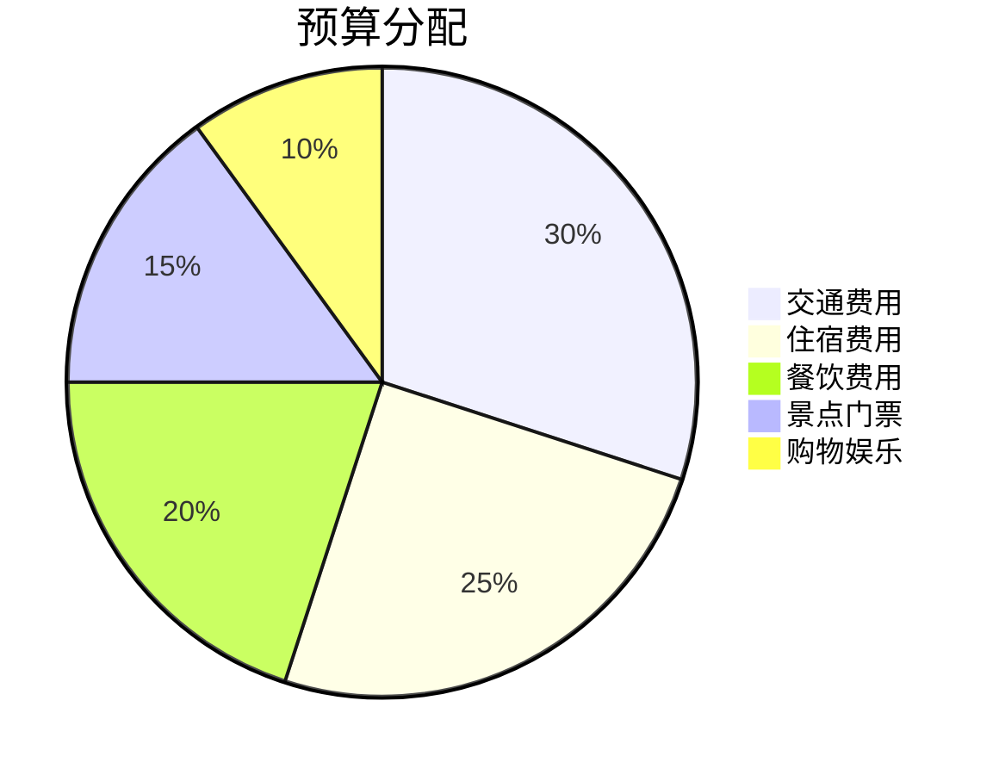
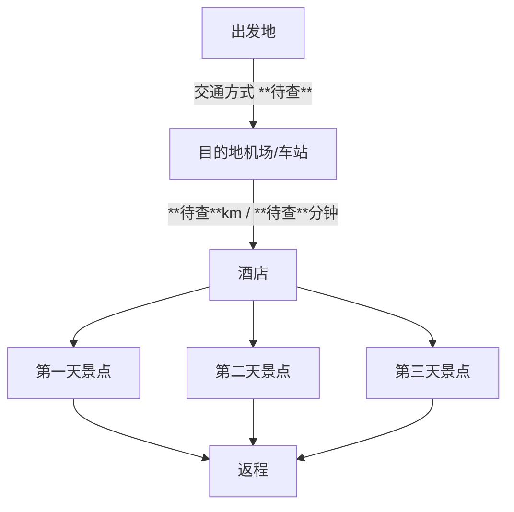

# 旅游概览 - [目的地名称]

## 基本信息

| 项目 | 详情 |
|------|------|
| 🗓️ **起始日期** | YYYY年M月D日 |
| ⏱️ **总天数** | X天X夜 |
| 👥 **旅行人数** | X人 |
| 💰 **预算范围** | ¥X,XXX - ¥X,XXX |
| 🌤️ **最佳旅行季节** | X月-X月 |

## 行程概述

```mermaid
gantt
    title 旅行时间线
    dateFormat  YYYY-MM-DD
    section 第一天
    抵达目的地    :YYYY-MM-DD, 1d
    section 第二天
    景点游览      :YYYY-MM-DD, 1d
    section 第三天
    深度体验      :YYYY-MM-DD, 1d
    section 第四天
    返程          :YYYY-MM-DD, 1d
```

### 行程亮点
- 🏛️ **文化体验**：参观历史古迹和博物馆
- 🌄 **自然风光**：欣赏壮丽的自然景观
- 🍜 **美食探索**：品尝当地特色美食
- 🛍️ **购物娱乐**：体验当地购物和娱乐活动

## 每日行程链接

| 日期 | 主要行程 | 详细文件 |
|------|----------|----------|
| 第1天 (M月D日) | 抵达 + 市区初探 | [📅 第一天详细行程](./%5B地区名称%5D旅游攻略/YYYY-MM-DD-第一天.md) |
| 第2天 (M月D日) | 主要景点游览 | [📅 第二天详细行程](./%5B地区名称%5D旅游攻略/YYYY-MM-DD-第二天.md) |
| 第3天 (M月D日) | 深度体验活动 | [📅 第三天详细行程](./%5B地区名称%5D旅游攻略/YYYY-MM-DD-第三天.md) |
| 第4天 (M月D日) | 购物 + 返程 | [📅 第四天详细行程](./%5B地区名称%5D旅游攻略/YYYY-MM-DD-第四天.md) |

## 重要注意事项

### 📋 出行准备
- [ ] 身份证/护照
- [ ] 机票/火车票确认
- [ ] 酒店预订确认
- [ ] 旅游保险
- [ ] 紧急联系人信息

### 🌡️ 天气与穿着
- **当季天气**：X°C - X°C
- **推荐穿着**：[根据季节和当地气候建议]
- **必备物品**：雨伞、防晒霜、舒适的行走鞋

### 💡 实用提示
- **当地货币**：人民币（建议准备现金和电子支付）
- **语言**：普通话/当地方言
- **时差**：无时差（境内旅行）
- **紧急电话**：110（报警）、120（急救）、119（消防）

### 🏥 健康与安全
- 携带常用药品（感冒药、肠胃药、创可贴等）
- 了解当地医院位置
- 保持手机电量充足
- 重要证件拍照备份

## 预算概览



| 费用类别 | 预算范围 | 备注 |
|----------|----------|------|
| 🚗 交通费用 | ¥XXX - ¥XXX | 包含往返交通和当地交通 |
| 🏨 住宿费用 | ¥XXX - ¥XXX | 每晚住宿费用 |
| 🍽️ 餐饮费用 | ¥XXX - ¥XXX | 每日三餐和小食 |
| 🎫 景点门票 | ¥XXX - ¥XXX | 主要景点门票费用 |
| 🛍️ 购物娱乐 | ¥XXX - ¥XXX | 纪念品和娱乐活动 |
| **总计** | **¥XXX - ¥XXX** | **预估总费用** |

## 🗺️ 路线规划图



### 主要地点坐标信息
| 地点名称 | 地址 | 坐标位置 | 备注 |
|----------|------|----------|------|
| 主要酒店 | **待查** | 纬度 **待查**，经度 **待查** | 住宿基地 |
| 核心景点A | **待查** | 纬度 **待查**，经度 **待查** | 必游景点 |
| 核心景点B | **待查** | 纬度 **待查**，经度 **待查** | 推荐景点 |
| 特色餐厅 | **待查** | 纬度 **待查**，经度 **待查** | 美食体验 |
| 购物中心 | **待查** | 纬度 **待查**，经度 **待查** | 购物娱乐 |

## 联系信息

### 紧急联系人
- **家人联系方式**：XXX-XXXX-XXXX
- **当地旅游热线**：XXX-XXXX-XXXX **待查**
- **酒店联系方式**：XXX-XXXX-XXXX **待查**

### 实用APP推荐
- 🗺️ **地图导航**：高德地图、百度地图
- 🚇 **公共交通**：当地地铁APP
- 🍽️ **美食推荐**：大众点评、美团
- 🏨 **住宿预订**：携程、去哪儿
- 💰 **支付工具**：支付宝、微信支付

---

## 📋 MCP 百度地图工具集成说明

> **智能地理位置查询系统**：
> 
> 本攻略模板集成了百度地图 MCP 工具，所有标注为 "**待查**" 的信息将在创建实际攻略时自动查询并替换为准确数据：
> 
> **自动查询内容**：
> - 🏨 酒店、景点、餐厅的精确地址和坐标
> - 🚗 各地点间的驾车、步行、公交距离和时间
> - 📞 景点门票价格、开放时间、联系电话
> - ⛽ 沿途加油站位置和油价信息
> - 🍽️ 餐厅评分、人均消费、特色菜品
> 
> **数据质量保证**：
> - ✅ **准确数据**：直接使用百度地图实时查询结果
> - ⚠️ **部分数据**：使用已获取信息，未获取部分保持 "**待查**"
> - ❌ **查询失败**：提供合理估算并明确标注 "**待查**"

*最后更新时间：YYYY年M月D日*  
*制作人：您的旅行导游 Cursor* 🧳✈️ 