# 第X天 - [日期] - [主题/重点活动]

## 📅 基本信息
- **日期**：YYYY年M月D日（星期X）
- **天气**：晴/多云/雨（X°C - X°C）
- **主题**：[当日主要活动主题，如"古城探索"、"自然风光"等]

## ⏰ 详细时间线

```mermaid
gantt
    title 第X天行程安排
    dateFormat  HH:mm
    axisFormat %H:%M
    section 上午
    早餐           :07:00, 08:00
    前往景点A      :08:00, 09:00
    游览景点A      :09:00, 11:30
    section 下午
    午餐           :11:30, 12:30
    前往景点B      :12:30, 13:00
    游览景点B      :13:00, 16:00
    section 晚上
    晚餐           :16:00, 18:00
    自由活动       :18:00, 21:00
```

| 时间 | 活动 | 地点 | 距离/交通 | 预计费用 | 备注 |
|------|------|------|----------|----------|------|
| 07:00-08:00 | 🍳 早餐 | 酒店/附近餐厅 | 步行 **待查** | ¥30-50 | 推荐：[具体餐厅名称] |
| 08:00-09:00 | 🚗 前往景点A | 交通路线 | 🚗 **待查**km / **待查**分钟 | ¥15-30 | 驾车路线，注意路况 |
| 09:00-11:30 | 🏛️ 游览景点A | [景点名称] | - | ¥XX-XX | 门票已含导游费 |
| 11:30-12:30 | 🍜 午餐 | 景点附近 | 步行 **待查** | ¥60-100 | 推荐：[餐厅名称] |
| 12:30-13:00 | 🚌 前往景点B | 交通路线 | 🚗 **待查**km / **待查**分钟 | ¥10-20 | 景点间距离较近 |
| 13:00-16:00 | 🌄 游览景点B | [景点名称] | - | ¥XX-XX | 建议停留时间3小时 |
| 16:00-18:00 | 🍽️ 晚餐 | 市区餐厅 | 🚗 **待查**km / **待查**分钟 | ¥80-150 | 品尝当地特色菜 |
| 18:00-21:00 | 🎪 自由活动 | 商业街/夜市 | 步行 **待查** | ¥50-200 | 购物、娱乐、夜景 |

> **📍 地理位置信息说明**：
> - 标注为 "**待查**" 的距离和时间信息将通过百度地图 MCP 工具进行精确查询
> - 🚗 表示驾车，🚌 表示公交，🚶 表示步行
> - 实际创建攻略时会自动替换为准确的地理位置数据

## 🎯 主要景点详情

### 景点A：[景点名称]

**基本信息**
- 📍 **地址**：[详细地址] **待查**
- 🗺️ **坐标位置**：纬度 **待查**，经度 **待查**
- ⏰ **开放时间**：08:00-18:00 **待查**
- 🎫 **门票价格**：成人¥XX **待查**，学生¥XX **待查**，儿童免费
- 🚗 **停车费用**：¥5/小时 **待查**
- 📞 **联系电话**：XXX-XXXX-XXXX **待查**
- 🚶 **从酒店距离**：**待查**km，步行约**待查**分钟
- 🚗 **驾车距离**：**待查**km，驾车约**待查**分钟

**推荐活动**
- [ ] 参观主要展厅/景区
- [ ] 拍照留念（推荐位置：[具体位置]）
- [ ] 体验特色项目：[具体项目名称]
- [ ] 购买纪念品

**游览路线**

**实用提示**
- 💡 建议游览时间：2.5小时
- 🚻 洗手间位置：入口、中部展厅、出口
- 🏪 纪念品店：出口处，营业至18:30
- ♿ 无障碍设施：有轮椅租赁服务

### 景点B：[景点名称]

**基本信息**
- 📍 **地址**：[详细地址] **待查**
- 🗺️ **坐标位置**：纬度 **待查**，经度 **待查**
- ⏰ **开放时间**：09:00-17:30 **待查**
- 🎫 **门票价格**：成人¥XX **待查**，优惠票¥XX **待查**
- 🚗 **停车情况**：免费停车场 **待查**
- 📞 **联系电话**：XXX-XXXX-XXXX **待查**
- 🚶 **从景点A距离**：**待查**km，步行约**待查**分钟
- 🚗 **驾车距离**：**待查**km，驾车约**待查**分钟

**推荐活动**
- [ ] 登高观景（推荐时间：下午14:00-16:00）
- [ ] 徒步自然步道
- [ ] 体验当地文化活动
- [ ] 品尝特色小食

## 🍽️ 美食推荐

### 早餐推荐
| 餐厅名称 | 招牌菜品 | 价格范围 | 距离酒店 | 评分 | 地址 |
|----------|----------|----------|----------|------|------|
| [餐厅A] **待查** | 小笼包、豆浆 | ¥15-30 **待查** | 🚶 **待查**m / **待查**分钟 | ⭐⭐⭐⭐⭐ | **待查** |
| [餐厅B] **待查** | 煎饼果子、小米粥 | ¥12-25 **待查** | 🚶 **待查**m / **待查**分钟 | ⭐⭐⭐⭐ | **待查** |

### 午餐推荐

| 餐厅名称 | 招牌菜品 | 价格范围 | 距离景点A | 特色 | 预订电话 | 地址 |
|----------|----------|----------|----------|------|----------|------|
| [餐厅C] **待查** | [特色菜1]、[特色菜2] | ¥60-100 **待查** | 🚶 **待查**m / **待查**分钟 | 百年老店 | XXX-XXXX **待查** | **待查** |
| [餐厅D] **待查** | [当地名菜] | ¥80-150 **待查** | 🚶 **待查**m / **待查**分钟 | 网红餐厅 | XXX-XXXX **待查** | **待查** |

### 晚餐推荐
| 餐厅名称 | 菜系类型 | 人均消费 | 距离景点B | 环境特色 | 推荐指数 | 地址 |
|----------|----------|----------|----------|----------|----------|------|
| [餐厅E] **待查** | 本地菜 | ¥120-200 **待查** | 🚗 **待查**km / **待查**分钟 | 江景/山景 | ⭐⭐⭐⭐⭐ | **待查** |
| [餐厅F] **待查** | 火锅 | ¥80-150 **待查** | 🚗 **待查**km / **待查**分钟 | 热闹氛围 | ⭐⭐⭐⭐ | **待查** |

## 🚗 交通与加油信息

### 景点间交通

### 详细路线信息
| 起点 | 终点 | 驾车距离 | 驾车时间 | 步行距离 | 步行时间 | 公交方案 |
|------|------|----------|----------|----------|----------|----------|
| 酒店 | 景点A | **待查**km | **待查**分钟 | **待查**km | **待查**分钟 | **待查** |
| 景点A | 景点B | **待查**km | **待查**分钟 | **待查**km | **待查**分钟 | **待查** |
| 景点B | 晚餐地点 | **待查**km | **待查**分钟 | **待查**km | **待查**分钟 | **待查** |
| 晚餐地点 | 酒店 | **待查**km | **待查**分钟 | **待查**km | **待查**分钟 | **待查** |

### 推荐加油站
| 加油站名称 | 位置 | 距离最近景点 | 油品价格 | 服务设施 | 地址 |
|------------|------|------------|----------|----------|------|
| [加油站A] **待查** | 景点A附近 | **待查**km / **待查**分钟 | 92#: ¥X.XX/升 **待查** | 便利店、洗手间 | **待查** |
| [加油站B] **待查** | 返回路线上 | **待查**km / **待查**分钟 | 95#: ¥X.XX/升 **待查** | 餐厅、休息区 | **待查** |

### 停车信息
- **景点A停车场**：¥5/小时，可停车200辆
- **景点B停车场**：免费，可停车100辆
- **餐厅停车**：大部分餐厅提供免费停车

## 💰 当日预算明细

| 项目 | 预算金额 | 实际花费 | 节省/超支 |
|------|----------|----------|-----------|
| 交通费 | ¥80 | ¥___ | ¥___ |
| 门票费 | ¥120 | ¥___ | ¥___ |
| 餐饮费 | ¥280 | ¥___ | ¥___ |
| 购物费 | ¥200 | ¥___ | ¥___ |
| 其他费用 | ¥50 | ¥___ | ¥___ |
| **总计** | **¥730** | **¥___** | **¥___** |

## 📝 旅行小贴士

### 🎒 今日必备物品
- [ ] 相机/手机充电宝
- [ ] 防晒霜、遮阳帽
- [ ] 舒适的行走鞋
- [ ] 雨伞（根据天气）
- [ ] 身份证件
- [ ] 现金和银行卡

### ⚠️ 注意事项
- 🕐 景点开放时间可能因季节调整，建议提前确认
- 📱 保持手机电量充足，下载离线地图
- 💊 携带常用药品（晕车药、肠胃药等）
- 🧴 多喝水，注意防晒
- 👥 人多时注意保管好个人物品

### 📸 拍照推荐
- **最佳拍照时间**：上午10:00-11:00，下午15:00-16:00
- **推荐拍照地点**：
  - 景点A：[具体位置描述]
  - 景点B：[具体位置描述]
  - 日落观景点：[位置]

## 🌟 今日亮点回顾
- [ ] 完成所有计划景点游览
- [ ] 品尝到当地特色美食
- [ ] 购买心仪的纪念品
- [ ] 拍摄到满意的照片
- [ ] 与当地人交流体验

---

**下一天预告**：明天我们将前往 [下一天主要目的地]，重点体验 [主要活动]！

---

## 📋 MCP 百度地图工具使用说明

> **自动化地理位置查询**：
> 
> 创建实际旅游攻略时，Cursor 将自动使用以下 MCP 工具替换所有 "**待查**" 标记：
> 
> 1. **地点搜索**：`mcp_baidu-maps_map_search_places` - 搜索景点、餐厅、酒店
> 2. **地址解析**：`mcp_baidu-maps_map_geocode` - 获取精确坐标位置
> 3. **路线规划**：`mcp_baidu-maps_map_directions` - 计算最优路线和时间
> 4. **批量距离**：`mcp_baidu-maps_map_directions_matrix` - 批量计算多点间距离
> 5. **详细信息**：`mcp_baidu-maps_map_place_details` - 获取门票、电话等详细信息
> 
> **数据准确性保证**：
> - ✅ 成功获取：使用精确的实时数据
> - ⚠️ 部分获取：使用已获取数据，其余保持 "**待查**" 标记
> - ❌ 无法获取：提供合理估算值并标注 "**待查**"

*制作时间：YYYY年M月D日*  
*您的专属旅行导游：Cursor* 🗺️✨ 