# 第1天 - 6月27日 - 抵达伊犁，开启草原之旅

## 📅 基本信息
- **日期**：2025年6月27日（星期五）
- **天气**：晴/多云（18°C - 26°C）
- **主题**：抵达适应 + 伊宁市区初探
- **住宿**：伊宁喆啡酒店

## ⏰ 详细时间线

```mermaid
gantt
    title 第1天行程安排
    dateFormat  HH:mm
    axisFormat %H:%M
    section 大连出发
    机场集合       :07:00, 08:30
    登机飞行       :08:30, 17:00
    section 抵达伊宁
    抵达伊宁       :17:00, 18:00
    机场取车       :18:00, 19:30
    前往酒店       :19:30, 20:30
    section 晚上
    晚餐休整       :20:30, 22:00
    早休适应       :22:00, 24:00
```

| 时间 | 活动 | 地点 | 预计费用 | 备注 |
|------|------|------|----------|------|
| 07:00-08:30 | ✈️ 机场集合办理登机 | 大连周水子机场 | - | 提前2小时到达机场 |
| 08:30-17:00 | 🛫 飞行（含中转） | 大连→伊宁 | 机票已购 | 距离：待查 |
| 17:00-18:00 | 🧳 取行李、出机场 | 伊宁机场 | - | 距离：待查 |
| 18:00-19:30 | 🚗 机场取车手续 | 伊宁机场租车点 | ¥200-300 | 距离：机场到租车点步行约100米 |
| 19:30-20:30 | 🏨 前往酒店入住 | 伊宁喆啡酒店 | - | 机场到酒店约20公里/25分钟 |
| 20:30-22:00 | 🍽️ 欢迎晚餐 | 喆啡酒店附近 | ¥150-250 | 酒店步行范围内，距离：待查 |
| 22:00-次日 | 😴 休息适应 | 喆啡酒店 | - | 距离：酒店内 |

## 🎯 主要任务详情

### 机场取车流程

**租车公司信息**
- 📍 **位置**：伊宁机场到达厅出口右侧
- ⏰ **营业时间**：08:00-22:00
- 📞 **联系电话**：0999-8139999
- 🚗 **推荐车型**：SUV（适合山区道路）

**取车检查清单**
- [ ] 检查车辆外观有无划痕
- [ ] 检查轮胎气压和备胎
- [ ] 确认燃油量和油品标号
- [ ] 测试灯光、雨刷、空调
- [ ] 检查车内清洁度
- [ ] 确认保险单据和紧急联系方式
- [ ] 熟悉车载导航系统

**必备证件**
- 身份证原件
- 驾驶证原件
- 信用卡（预授权）
- 租车确认单

### 伊宁市区概况

**基本信息**
- 📍 **位置**：新疆维吾尔自治区伊犁州首府
- 👥 **人口**：约55万
- 🌡️ **海拔**：663米
- 🗣️ **主要语言**：汉语、维吾尔语、哈萨克语

**市区特色**
- 多民族聚居城市
- 丝绸之路重要节点
- 伊犁河谷商贸中心
- 薰衣草产业基地

## 🍽️ 美食推荐

### 欢迎晚餐推荐
| 餐厅名称 | 招牌菜品 | 价格范围 | 距离喆啡酒店 | 评分 |
|----------|----------|----------|----------|------|
| 伊犁老街大盘鸡 | 大盘鸡、手抓饭 | ¥120-200 | 步行10分钟 | ⭐⭐⭐⭐⭐ |
| 阿凡提餐厅 | 烤羊肉串、拌面 | ¥100-180 | 步行5分钟 | ⭐⭐⭐⭐ |
| 伊宁饭店 | 新疆菜系合集 | ¥150-250 | 步行8分钟 | ⭐⭐⭐⭐⭐ |

**推荐菜品**
- 🥘 **大盘鸡**：新疆经典菜，土豆配鸡肉
- 🍚 **手抓饭**：新疆主食，胡萝卜羊肉饭
- 🥩 **烤羊肉串**：正宗新疆烤串
- 🍜 **拌面**：新疆面食，配菜丰富
- 🥛 **奶茶**：咸味奶茶，当地特色

## 🚗 交通信息

### 机场到市区路线

**详细路线**
1. 出伊宁机场，上G30连霍高速
2. 行驶约15公里，从伊宁/霍城出口下高速
3. 沿218国道进入市区
4. 根据酒店位置导航到达

**注意事项**
- 机场高速路况良好
- 注意限速标志（一般80-100km/h）
- 市区内限速40-60km/h
- 停车位相对充足

### 加油站推荐
| 加油站名称 | 位置 | 油品价格 | 服务设施 |
|------------|------|----------|----------|
| 中石油伊宁站 | 机场路附近 | 92#: ¥7.85/升 | 24小时、便利店 |
| 中石化伊宁东站 | 市区东部 | 95#: ¥8.45/升 | 洗车、维修 |

## 🏨 住宿信息

### 推荐酒店区域
- **伊宁市中心**：交通便利，餐饮购物方便
- **伊犁河畔**：环境优美，价格适中
- **商业区附近**：现代化设施，服务完善

### 酒店设施检查
- [ ] WiFi信号强度
- [ ] 热水供应情况
- [ ] 空调制冷效果
- [ ] 停车位安排
- [ ] 早餐时间和内容

## 💰 当日预算明细

| 项目 | 预算金额 | 实际花费 | 节省/超支 |
|------|----------|----------|-----------|
| 租车取车费 | ¥250 | ¥___ | ¥___ |
| 机场到酒店油费 | ¥30 | ¥___ | ¥___ |
| 晚餐费用 | ¥200 | ¥___ | ¥___ |
| 停车费 | ¥20 | ¥___ | ¥___ |
| 其他杂费 | ¥50 | ¥___ | ¥___ |
| **总计** | **¥550** | **¥___** | **¥___** |

## 📝 旅行小贴士

### 🎒 今日必备物品
- [ ] 身份证、驾驶证原件
- [ ] 手机、充电宝
- [ ] 现金（部分地方不支持电子支付）
- [ ] 太阳镜、防晒霜
- [ ] 薄外套（昼夜温差大）
- [ ] 肠胃药（适应当地饮食）

### ⚠️ 注意事项
- 🕐 新疆实际比北京时间晚2小时，但统一使用北京时间
- 📱 确保手机开通漫游或购买当地卡
- 💊 初到高原地区，避免剧烈运动
- 🌊 多喝水，注意补充水分
- 🧴 新疆日照强烈，注意防晒
- 🍽️ 当地饮食偏重口味，肠胃敏感者注意

### 📸 拍照推荐
- **机场**：新疆特色建筑
- **路上风景**：远山雪峰
- **市区夜景**：多民族文化融合
- **美食**：第一餐新疆菜

### 🌟 适应建议
- **时差调整**：早睡早起，配合当地作息
- **饮食调整**：少量多餐，多喝水
- **心理准备**：保持开放心态，体验多元文化
- **语言准备**：学几句基本的维吾尔语或哈萨克语问候语

## 🌟 今日亮点回顾
- [ ] 顺利抵达伊宁，完成租车手续
- [ ] 初步了解伊宁市区环境
- [ ] 品尝到正宗新疆美食
- [ ] 适应当地气候和时差
- [ ] 为后续行程做好准备

---

**明日预告**：明天我们将前往被誉为"大西洋最后一滴眼泪"的赛里木湖，体验高山湖泊的绝美风光！

*制作时间：2025年6月25日*  
*您的专属旅行导游：Cursor* 🗺️✨ 