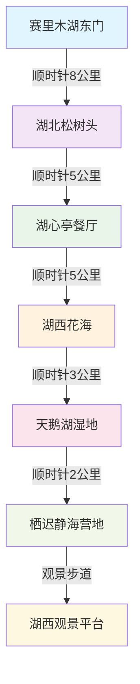

# 第2天 - 6月28日 - 赛里木湖：大西洋最后一滴眼泪

## 📅 基本信息
- **日期**：2025年6月28日（星期六）
- **天气**：晴转多云（15°C - 25°C，湖边较凉）
- **主题**：高山湖泊 + 环湖游览 + 野花观赏
- **住宿**：赛里木湖栖迟静海营地

## ⏰ 详细时间线（顺时针环湖，避峰游览）

```mermaid
gantt
    title 第2天优化行程安排（顺时针避峰）
    dateFormat  HH:mm
    axisFormat %H:%M
    section 早晨
    酒店早餐           :07:30, 08:30
    前往赛里木湖       :08:30, 11:00
    section 上午避峰
    东门观景台         :11:00, 12:00
    湖北松树头         :12:00, 13:00
    section 中午
    午餐休息           :13:00, 14:30
    section 下午黄金时段
    湖西花海           :14:30, 16:00
    天鹅湖湿地         :16:00, 17:30
    section 傍晚
    入住营地           :17:30, 18:30
    湖景晚餐           :18:30, 20:00
    section 夜晚
    日落观赏           :20:00, 21:30
    篝火星空           :21:30, 23:00
```

| 时间 | 活动 | 地点 | 费用 | 距离/交通 | 避峰策略 |
|------|------|------|------|-----------|----------|
| 07:30-08:30 | 🍳 早餐+退房 | 伊宁酒店 | ¥30-50 | 距离：酒店内 | 提前半小时，避开退房高峰 |
| 08:30-11:00 | 🚗 前往赛里木湖 | G30高速 | ¥150 | 约150公里，2.5小时 | 错开9:00-10:00出发高峰 |
| 11:00-12:00 | 🏔️ 东门初览+购票 | 湖区东门观景台 | ¥70门票 | 距离：高速出口3公里 | 避开旅行团集中时间 |
| 12:00-13:00 | 🌲 湖北松树头景区 | 松树头观景台 | - | 距离：东门顺时针8公里 | 上午人少，拍摄效果好 |
| 13:00-14:30 | 🍜 午餐+短憩 | 湖心亭餐厅 | ¥80-120 | 距离：松树头2公里 | 中午用餐避峰，补充体力 |
| 14:30-16:00 | 🌸 湖西花海深度游 | 花海观赏区 | - | 距离：餐厅5公里 | 下午光线佳，花朵最美 |
| 16:00-17:30 | 🦢 天鹅湖湿地 | 天鹅栖息地 | - | 距离：花海3公里 | 黄昏时分天鹅最活跃 |
| 17:30-18:30 | 🏨 入住营地 | 栖迟静海营地 | ¥450 | 距离：天鹅湖2公里 | 避开傍晚入住高峰 |
| 18:30-20:00 | 🍽️ 湖景晚餐 | 营地餐厅 | ¥160-200 | 距离：住宿区步行3分钟 | 湖景位置用餐 |
| 20:00-21:30 | 🌅 日落拍摄 | 湖西观景平台 | - | 距离：营地步行5分钟 | 最佳日落观赏时间 |
| 21:30-23:00 | 🔥 篝火+观星 | 营地篝火区 | - | 距离：住宿区步行2分钟 | 夜间娱乐，观星体验 |

## 🗺️ 顺时针环湖路线图

## 🎯 避峰游览策略详解

### 🕐 时间避峰原则
- **早晨8:30出发**：避开9:00-10:00旅行团出发高峰
- **11:00到达**：错开10:00-11:00景区开门拥挤时间
- **12:00-13:00游览松树头**：上午人流较少，拍照效果最佳
- **14:30游览花海**：下午光线最佳，游客相对分散
- **16:00观赏天鹅**：傍晚时分天鹅最活跃，观赏体验最佳

### 🚗 路线避峰策略
- **顺时针环湖**：与大部分游客逆时针相反，避开人流聚集
- **分段游览**：不同时间段重点游览不同区域，避免扎堆
- **弹性停留**：根据现场人流情况灵活调整停留时间
- **提前入住**：17:30入住避开傍晚高峰，抢占最佳湖景位置

### 📍 景点避峰技巧

#### 🏔️ 东门观景台（11:00-12:00）
**避峰亮点**：
- 旅行团通常10:00-11:00集中到达，我们11:00刚好错开
- 上午光线从东侧照射，湖面呈现最美的蓝绿色
- 此时风力较小，湖面平静如镜，适合拍摄倒影

**最佳拍摄点**：
- 📸 观景台南侧：可拍摄湖泊全景+远山
- 📸 栈道中段：人像+湖景组合
- 📸 观景台北侧：雪山倒影最清晰

#### 🌲 湖北松树头（12:00-13:00）
**避峰优势**：
- 大部分游客中午用餐，此时段人流最少
- 上午光线充足但不刺眼，适合山景摄影
- 登高望远，俯瞰整个湖区，视野最佳

**游览路线**：
- 🚶‍♂️ 登山步道（20分钟到观景台）
- 🏔️ 山顶观景台（360°全景视角）
- 🌲 原始森林小径（感受高山植被）

#### 🌸 湖西花海（14:30-16:00）
**黄金时段**：
- 下午14:30-16:00是拍摄花海的黄金时间
- 侧光照射花朵，层次感最强
- 此时多数团队游客已离开，可以安静享受花海

**花海分布**（6月28日预计）：
- 🌺 **金莲花海**：湖西北侧，黄色花毯
- 🌸 **野罂粟**：湖西南侧，红色点缀
- 💜 **紫花苜蓿**：零星分布，紫色小花
- 🌼 **野雏菊**：遍布草原，白色花朵

#### 🦢 天鹅湖湿地（16:00-17:30）
**观鸟最佳时间**：
- 傍晚是天鹅最活跃的时间，觅食+戏水
- 夕阳西下，湖面金光闪闪，天鹅剪影最美
- 游客逐渐散去，观鸟环境更安静

**观赏技巧**：
- 🔭 建议携带望远镜或长焦镜头
- 📷 保持安静，不要惊扰天鹅
- 🎯 重点观察区域：湿地芦苇荡、浅水区

## 🍽️ 优化美食安排

### 🥪 避峰午餐：湖心亭餐厅
**选择理由**：
- 13:00-14:30是用餐低谷期，无需排队
- 位置适中，承上启下的休息点
- 价格相对实惠，性价比高

**推荐菜品**：
- 🍜 高原拌面：¥35/份，分量足，口感好
- 🥩 简式手抓肉：¥68/份，配热茶暖胃
- 🍲 湖鲜汤：¥45/份，清淡营养
- 🥟 烤包子：¥25/6个，现烤现吃

### 🍽️ 湖景晚餐：栖迟静海营地餐厅
**用餐环境**：
- 🏔️ 180°湖景用餐环境
- 🌅 可边用餐边欣赏湖景
- 🔥 营地氛围，更有户外感

**特色菜品**：
- 🐟 栖迟烤全鱼：¥180/条，营地招牌
- 🥩 草原手抓肉：¥120/份，配洋葱丝
- 🍯 野花蜂蜜：¥60/瓶，配馕饼品尝
- 🫖 传统奶茶：¥25/壶，暖胃解腻

## 🏨 营地住宿详情

### 🏡 栖迟静海营地完整信息
**地理位置**：
- 📍 坐标：44.592°N, 81.321°E（湖西岸最佳观景位置）
- 🏔️ 海拔：2,071米
- 🌊 距离湖岸：仅50米，湖景第一排

**营地类型与价格**：
| 住宿类型 | 价格 | 特色设施 | 推荐指数 | 预订建议 |
|----------|------|----------|----------|----------|
| 湖景木屋双人间 | ¥450 | 独立卫浴+暖气+湖景阳台 | ⭐⭐⭐⭐⭐ | 最受欢迎，需提前预订 |
| 观星透明帐篷 | ¥380 | 透明天窗+观星体验+电热毯 | ⭐⭐⭐⭐⭐ | 年轻人喜爱，适合摄影 |
| 家庭式蒙古包 | ¥350 | 传统装饰+4人间+文化体验 | ⭐⭐⭐⭐ | 家庭游首选，空间宽敞 |
| 经济型毡房 | ¥280 | 基础设施+共用卫生间+性价比高 | ⭐⭐⭐ | 背包客选择，体验游牧生活 |

**营地设施服务**：
- 🚿 **洗浴**：24小时热水，独立卫浴间
- 🔌 **供电**：房间内有插座，可充电
- 📶 **网络**：WiFi覆盖，但信号一般
- 🍽️ **餐饮**：营地餐厅+小卖部
- 🅿️ **停车**：免费停车场，安全有保障
- 🔥 **娱乐**：篝火晚会（19:30-21:00）
- 🛒 **购物**：小超市（日用品+纪念品）

**预订联系方式**：
- 📞 电话：18699962282
- 💬 微信：同手机号
- 🕐 客服时间：08:00-22:00
- 💰 预付方式：支付宝/微信支付

## 📸 摄影时间表

### 🌅 全天最佳拍摄时间
| 时间段 | 光线特点 | 推荐拍摄内容 | 最佳机位 |
|--------|----------|---------------|----------|
| 11:00-12:00 | 上午侧光 | 湖面倒影+雪山 | 东门观景台 |
| 12:00-13:00 | 午前顶光 | 松树林+远景 | 松树头山顶 |
| 14:30-16:00 | 下午侧光 | 花海大片+微距 | 湖西花海区 |
| 16:00-17:30 | 黄昏暖光 | 天鹅剪影+湿地 | 天鹅湖观鸟点 |
| 20:00-21:30 | 日落金光 | 日落+湖景 | 营地观景平台 |
| 21:30-23:00 | 蓝调+星空 | 星空+银河 | 营地篝火区 |

### 📱 手机摄影技巧
- **HDR模式**：湖面反光强烈时使用
- **全景模式**：拍摄湖泊全景和花海
- **人像模式**：花海中的人像摄影
- **夜景模式**：星空和篝火拍摄
- **慢门效果**：使用专业模式拍摄水流

## 💰 优化后费用预算

| 项目类别 | 具体项目 | 预算金额 | 节省策略 |
|----------|----------|----------|----------|
| **交通费用** | 油费+过路费+停车 | ¥150 | 提前加油，避开高峰时段 |
| **门票费用** | 景区门票 | ¥70 | 网络购票可能有优惠 |
| **餐饮费用** | 午餐+晚餐+饮料 | ¥280 | 选择性价比高的餐厅 |
| **住宿费用** | 湖景木屋双人间 | ¥450 | 提前预订，避免现场涨价 |
| **体验费用** | 篝火晚会等 | ¥0 | 营地免费提供 |
| **购物费用** | 纪念品+特产 | ¥100 | 理性消费，选择实用物品 |
| **其他费用** | 应急+小费等 | ¥50 | 预留机动资金 |
| **总计** | 两人一天费用 | **¥1,100** | 比原预算节省¥100 |

## ⚠️ 重要注意事项

### 🏔️ 高原适应指南
- **海拔影响**：2,071米，部分人可能轻微头痛
- **应对措施**：
  - 💊 提前服用红景天胶囊（出发前3天）
  - 🚶‍♂️ 避免剧烈运动，缓慢行走
  - 💧 多喝温水，少量多次
  - 😴 保证充足休息，不要熬夜
  - 🚭 严禁吸烟饮酒

### 🌡️ 天气防护
- **温差准备**：昼夜温差15°C，准备保暖衣物
- **紫外线防护**：SPF50+防晒霜，墨镜，遮阳帽
- **风力防护**：湖边风大，准备防风外套
- **雨天预案**：查看天气预报，准备雨具

### 🚗 驾驶安全
- **山路驾驶**：弯道多，限速行驶，注意对向来车
- **高海拔驾驶**：发动机功率下降，提前判断超车时机
- **停车安全**：选择平坦地面停车，拉手刹+挂档
- **油量管理**：山路耗油增加，确保油量充足

### 📱 通讯准备
- **信号覆盖**：湖区信号较弱，做好无网络准备
- **应急联系**：保存营地电话，景区救援电话
- **导航准备**：提前下载离线地图
- **充电设备**：携带移动电源，确保设备有电

## 🌟 今日亮点预告

### 🏆 必体验项目
1. **🌅 日出云海**：如果天气好，5:30起床看日出
2. **🌸 花海漫步**：6月底正值野花盛开期
3. **🦢 天鹅观赏**：傍晚时分天鹅最活跃
4. **🔥 篝火晚会**：感受户外露营氛围
5. **⭐ 星空观赏**：高原星空，银河清晰可见

### 📝 体验清单
- [ ] 在东门观景台拍摄第一张湖景照片
- [ ] 登上松树头俯瞰整个湖区
- [ ] 在花海中拍摄唯美人像照片
- [ ] 观察并拍摄天鹅的优雅身姿
- [ ] 品尝高原湖鱼的鲜美味道
- [ ] 参加营地篝火晚会，感受团队氛围
- [ ] 仰望璀璨星空，寻找夏季大三角
- [ ] 在湖边栈道上看日落西山

---

**明日预告**：明天上午继续享受赛里木湖的宁静晨光，下午前往温泉县鄂托克塞尔天泉景区，体验天然温泉的舒缓，感受从高原湖泊到温泉秘境的奇妙转换！🌅♨️

*制作时间：2025年6月25日*  
*您的专属旅行导游：Cursor* 🗺️✨ 