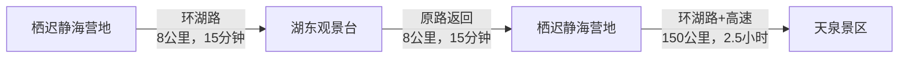

# 第3天 - 6月29日 - 天泉温泉：雪山下的温泉秘境

## 📅 第三天：赛里木湖日出→天泉温泉 (2025年6月29日)

### 🌤️ 基本信息
- **日期**：2025年6月29日（周日）
- **天气**：多云转晴，18-28°C
- **住宿**：天泉国际温泉度假酒店
- **主要行程**：赛里木湖日出观赏，前往天泉景区，温泉体验

---

### ⏰ 详细时间线（含日出观赏）

```mermaid
gantt
    title 第3天优化行程安排（含日出观赏）
    dateFormat  HH:mm
    axisFormat %H:%M
    section 清晨日出
    起床准备           :05:30, 06:00
    前往日出点         :06:00, 06:15
    日出观赏           :06:15, 07:30
    section 上午
    返回早餐           :07:30, 09:00
    退房准备           :09:00, 09:30
    前往天泉           :09:30, 12:00
    section 下午
    入住午餐           :12:00, 13:30
    温泉体验           :13:30, 17:00
    景区游览           :17:00, 18:30
    section 晚上
    温泉晚餐           :18:30, 20:00
    夜间温泉           :20:00, 22:30
```

| 时间 | 活动 | 地点 | 费用 | 距离/交通 | 备注 |
|------|------|------|------|-----------|------|
| 05:30-06:00 | 🌅 起床+简单洗漱 | 栖迟静海营地 | - | 距离：住宿区内 | 准备观日出，注意保暖 |
| 06:00-06:15 | 🚗 前往日出观景点 | 湖东岸最佳观景台 | - | 距离：营地开车15分钟/8公里 | 抢占最佳观景位置 |
| 06:15-07:30 | 🌅 赛里木湖日出 | 湖东观景台 | - | 距离：观景台现场 | 6月29日日出时间约06:28 |
| 07:30-09:00 | 🍳 返回营地早餐 | 栖迟静海营地 | ¥50-80 | 距离：观景台返回营地8公里 | 湖景早餐，整理行李 |
| 09:00-09:30 | 🎒 退房+装车 | 栖迟静海营地 | - | 距离：住宿区内 | 告别赛里木湖 |
| 09:30-12:00 | 🚗 前往天泉景区 | 温泉县方向 | ¥120-180 | 约150公里，2.5小时车程 | 经G30高速，山路景色优美 |
| 12:00-13:30 | 🍜 抵达午餐+入住 | 天泉国际温泉度假酒店 | ¥100-150 | 距离：酒店内 | 办理入住，休息调整 |
| 13:30-17:00 | 🌡️ 温泉初体验 | 酒店温泉区 | 已含 | 距离：酒店内 | 室内外温泉池放松 |
| 17:00-18:30 | 🏔️ 天泉景区游览 | 景区步道 | ¥20门票 | 距离：酒店步行5-10分钟 | 瀑布森林自然风光 |
| 18:30-20:00 | 🍽️ 温泉养生晚餐 | 酒店餐厅 | ¥150-250 | 距离：酒店内 | 特色养生菜品 |
| 20:00-22:30 | 🌙 夜间温泉浴 | 户外温泉池 | 已含 | 距离：酒店内 | 星空下泡温泉 |

---

### 🌅 赛里木湖日出观赏攻略

#### 📍 最佳日出观景点
**湖东岸观景台**（推荐⭐⭐⭐⭐⭐）
- **位置**：赛里木湖东岸主观景台
- **坐标**：44.613°N, 81.401°E
- **距离营地**：约8公里，开车15分钟
- **优势**：
  - 正东方向，日出正面观赏
  - 视野开阔，无遮挡物
  - 有停车场和观景平台
  - 湖面倒影效果最佳

#### ⏰ 日出时间安排
**6月29日日出时间表**：
- **日出时间**：06:28（北京时间）
- **晨曦开始**：05:45
- **最佳观赏**：06:15-07:30
- **黄金时段**：06:20-06:40

**时间节点规划**：
- 05:30 起床洗漱（简单即可）
- 06:00 出发前往观景台
- 06:15 到达观景台，架设设备
- 06:20 晨曦开始，天空渐亮
- 06:28 太阳升起，开始拍摄
- 06:40 日出完成，继续欣赏
- 07:30 返回营地享用早餐

#### 🎒 日出观赏必备物品
- [ ] **保暖衣物**：羽绒服或厚外套（晨间温度5-8°C）
- [ ] **摄影设备**：相机、三脚架、充电宝
- [ ] **照明工具**：手电筒或头灯（天未亮时使用）
- [ ] **热饮**：保温杯装热水或热茶
- [ ] **防滑鞋**：观景台可能有露水，注意防滑
- [ ] **毛毯**：可铺在地上或披在身上保暖
- [ ] **零食**：巧克力等高热量食物补充体力

#### 📸 日出摄影技巧
**拍摄参数建议**：
- **ISO**：100-400（保证画质）
- **光圈**：f/8-f/11（保证景深）
- **快门**：根据光线调整，使用三脚架
- **对焦**：手动对焦到无穷远
- **构图**：前景湖面，中景远山，背景天空

**拍摄内容推荐**：
1. **日出全过程延时摄影**
2. **太阳从山峰升起的瞬间**
3. **湖面金光闪闪的倒影**
4. **远山雪峰被染成金色**
5. **人物剪影与日出的组合**
6. **晨雾缭绕的湖面景象**

#### 🌡️ 晨间注意事项
- **温度**：晨间温度5-8°C，比白天低15-20°C
- **风力**：湖边风大，注意防风保暖
- **露水**：观景台可能有露水，穿防滑鞋
- **高反**：海拔2071米，避免剧烈运动
- **安全**：天未亮时注意脚下安全，使用照明设备

---

### 🚗 优化后交通路线

#### 营地→日出观景台→营地→天泉景区

**详细路线说明**：
1. **06:00出发**：营地→环湖路→湖东观景台（8公里/15分钟）
2. **07:30返回**：观景台→原路返回→营地（8公里/15分钟）
3. **09:30出发**：营地→环湖路→东门→G30高速→温泉县→天泉景区（150公里/2.5小时）

**路况提醒**：
- 清晨环湖路车辆较少，但光线较暗需谨慎驾驶
- 观景台有免费停车位，但需早到占位
- 返程路线与正常路线相同

---

### 🎯 景点详情

#### 🌅 湖东观景台日出体验
- **观景台设施**：
  - 木质观景平台，安全护栏
  - 免费停车场（约50个车位）
  - 简易卫生间
  - 垃圾桶和休息座椅

- **日出观赏体验**：
  - **05:45-06:15**：晨曦渐现，天空由深蓝转为浅蓝
  - **06:15-06:28**：东方天际线出现橙红色光芒
  - **06:28-06:35**：太阳从远山升起，湖面金光闪闪
  - **06:35-07:00**：阳光洒向湖面，雪山被染成金色
  - **07:00-07:30**：完整日出过程结束，可继续欣赏晨光

- **特殊景观**：
  - 🌊 **湖面倒影**：平静湖面完美倒映日出景象
  - 🏔️ **雪山日照金山**：远处雪峰在晨光中呈现金色
  - 🌫️ **晨雾缭绕**：湖面可能有轻雾，增添仙境感
  - 🦢 **天鹅晨舞**：运气好可能看到天鹅在晨光中游弋

#### 🌡️ 天泉国际温泉度假酒店
- **地址**：温泉县鄂托克赛天泉景区内
- **坐标**：44.805737°N, 80.866315°E
- **电话**：(0909)8772225
- **温泉特色**：
  - 室内温泉池：恒温38-42°C，四季可用
  - 户外温泉池：天然温泉，富含硫磺等矿物质
  - 特色汤池：玫瑰池、薰衣草池、中药池
  - 理疗区：按摩、足疗、汗蒸等服务
- **开放时间**：24小时（部分区域有时间限制）

---

### 🍽️ 美食推荐

#### 🍳 营地早餐（日出后）
**栖迟静海营地餐厅**
- **营业时间**：07:00-10:00
- **特色早餐**：
  - 新疆奶茶：¥15/壶，暖胃驱寒
  - 手工馕饼：¥8/个，配酱菜
  - 白粥小菜：¥25/份，清淡养胃
  - 煮鸡蛋：¥5/个，补充蛋白质
  - 酸奶：¥12/杯，当地特产
- **推荐搭配**：奶茶+馕饼+煮鸡蛋+酸奶（¥40/人）

#### 🍜 天泉酒店午餐
**天泉国际温泉度假酒店餐厅**
- **位置**：酒店一楼大堂
- **营业时间**：11:30-14:00
- **推荐菜品**：
  - 温泉煮蛋：¥15/个，利用天然温泉煮制
  - 野菜火锅：¥128/锅，当地采摘的新鲜野菜
  - 温泉鱼：¥88/份，温泉水养殖的鲜鱼
  - 哈萨克手抓肉：¥168/份，传统做法
- **人均消费**：¥100-150

---

### 💰 优化后费用预算

| 项目 | 费用范围 | 备注 |
|------|----------|------|
| 日出观景往返油费 | ¥20-30 | 往返16公里 |
| 早餐 | ¥50-80 | 营地湖景早餐 |
| 油费+过路费 | ¥120-180 | 往返约300公里 |
| 天泉景区门票 | ¥20×2人 | 酒店客人优惠价 |
| 午餐 | ¥100-150 | 酒店餐厅 |
| 住宿 | ¥580-780 | 温泉套房推荐 |
| 晚餐 | ¥150-250 | 温泉养生餐 |
| SPA体验 | ¥200-400 | 可选项目 |
| 其他 | ¥50-100 | 纪念品等 |
| **总计** | **¥1,290-2,010** | 两人一天预算（含日出） |

---

### 📸 全天摄影时间表

| 时间段 | 光线特点 | 推荐拍摄内容 | 最佳机位 |
|--------|----------|---------------|----------|
| 06:15-07:30 | 日出金光 | 日出全过程+湖面倒影 | 湖东观景台 |
| 07:30-09:00 | 晨光柔和 | 营地湖景+早餐场景 | 营地观景平台 |
| 13:30-17:00 | 下午侧光 | 温泉体验+雪山背景 | 户外温泉池 |
| 17:00-18:30 | 黄昏暖光 | 瀑布森林+自然风光 | 天泉景区步道 |
| 20:00-22:30 | 夜景蓝调 | 星空温泉+灯光倒影 | 户外温泉池 |

---

### ⚠️ 重要注意事项

#### 🌅 日出观赏注意事项
- **起床时间**：05:30起床，确保06:00准时出发
- **保暖措施**：晨间温度5-8°C，必须穿厚外套
- **安全驾驶**：清晨光线较暗，注意行车安全
- **占位策略**：06:15前到达，抢占最佳观景位置
- **体力管理**：早起观日出，中午可在酒店休息补觉

#### 🚗 交通安全
- **夜间驾驶**：清晨天未亮，开启车灯谨慎驾驶
- **路况熟悉**：提前熟悉去观景台的路线
- **油量检查**：确保油量充足，避免半路没油
- **应急准备**：携带手电筒、充电宝等应急物品

#### 🌡️ 温泉体验
- **时间安排**：日出后可能疲劳，温泉有助恢复体力
- **健康状况**：早起观日出后注意休息，避免过度疲劳
- **补水重要**：早起+温泉，需要及时补充水分

---

### 🌟 今日亮点预告

1. **🌅 绝美日出** - 赛里木湖东岸观赏壮丽日出，湖面倒影如画
2. **🏔️ 日照金山** - 远山雪峰在晨光中呈现金色，震撼心灵
3. **🚗 山路风光** - 150公里穿越天山余脉的壮美景色
4. **🌡️ 温泉放松** - 早起观日出后，温泉放松恢复体力
5. **🌙 星空温泉** - 夜晚户外温泉的浪漫体验

### 📝 体验清单
- [ ] 05:30起床准备观日出
- [ ] 在湖东观景台拍摄赛里木湖绝美日出
- [ ] 体验日照金山的壮观景象
- [ ] 在营地享用湖景早餐
- [ ] 体验天然温泉的神奇功效
- [ ] 品尝温泉煮蛋的独特美味
- [ ] 徒步天泉景区的森林步道
- [ ] 在星空下体验户外温泉的浪漫

---

*明日预告：天泉温泉 → 博乐市，从山区温泉到边境城市的文化体验* 🏙️🛍️

*制作时间：2025年6月25日*  
*您的专属旅行导游：Cursor* 🗺️✨ 