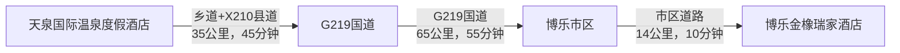

# 第4天 - 6月30日 - 博乐：边境小城的丝路风情

## 📅 第四天：天泉温泉→博乐市 (2025年6月30日)

### 🌤️ 基本信息
- **日期**：2025年6月30日（周一）
- **天气**：晴，20-32°C
- **住宿**：博乐金橡瑞家酒店
- **主要行程**：温泉度假村，前往博乐市，城市观光购物

---

### ⏰ 详细时间线

| 时间 | 活动 | 地点 | 费用 | 距离/交通 | 备注 |
|------|------|------|------|-----------|------|
| 08:00-10:00 | 🌡️ 最后温泉+早餐 | 天泉酒店 | ¥80-120 | 距离：酒店内 | 享受最后的温泉时光 |
| 10:00-12:00 | 🏔️ 天泉景区深度游 | 山谷步道 | 已含 | 距离：酒店步行约5-10分钟 | 瀑布森林探索 |
| 12:00-14:00 | 🚗 前往博乐市 | G219国道 | ¥80-120 | 约114公里，1小时50分钟车程 | 经过草原风光 |
| 14:00-15:30 | 🍜 博乐午餐+入住 | 博乐金橡瑞家酒店 | ¥80-150 | 距离：酒店内 | 办理入住，休息调整 |
| 15:30-17:00 | 🏛️ 滨河公园游览 | 博乐滨河公园 | 免费 | 酒店到公园约1.2公里/步行15分钟 | 城市绿肺，休闲漫步 |
| 17:00-18:30 | 🛍️ 海西国际大巴扎 | 海西国际大巴扎 | ¥100-200 | 公园到大巴扎约3公里/10分钟车程 | 特产采购，文化体验 |
| 18:30-20:00 | 🍽️ 艾莱茵餐厅晚餐 | 艾莱茵餐厅 | ¥120-200 | 大巴扎到餐厅约1.5公里/步行20分钟 | 品尝当地美食 |
| 21:00-22:30 | 🌙 夜市文化体验 | 博乐夜市 | ¥50-150 | 餐厅到夜市约1公里/步行15分钟 | 感受夜生活 |

---

### 🚗 交通路线详情

#### 天泉国际温泉度假酒店到博乐金橡瑞家酒店路线

**详细路线说明**：
- **天泉酒店** → 乡道 → X210县道 → G219国道 → 博乐市区 → 北京北路
- **总距离**：约114公里
- **预计车程**：1小时50分钟
- **过路费**：约19元
- **路况**：前段山路，后段国道，整体路况良好

---

### 🎯 景点详情

#### 🏔️ 天泉景区深度游
- **游览时间**：2小时
- **距离**：酒店步行5-10分钟
- **主要路线**：
  - 瀑布观景台：欣赏50米落差瀑布
  - 森林步道：2公里原始森林徒步
  - 野生动物观察点：可能遇见松鼠、野鸟
  - 山顶观景台：俯瞰整个温泉谷

#### 🏛️ 博乐滨河公园
- **地址**：博乐市北京南路1号
- **坐标**：44.877492°N, 82.067123°E
- **距离**：从金橡瑞家酒店步行约15分钟
- **开放时间**：全天开放
- **主要景点**：
  - 博尔塔拉纪念园：了解当地历史文化
  - 游船码头：可乘船游览博尔塔拉河
  - 休息亭：多个观景休息点
  - 绿化步道：适合散步健身

#### 🛍️ 海西国际大巴扎
- **地址**：博乐市前进路11号
- **坐标**：44.914557°N, 82.081202°E
- **距离**：从滨河公园约3公里/10分钟车程
- **营业时间**：10:00-22:00
- **特色商品**：
  - 新疆干果：葡萄干、核桃、大枣
  - 民族工艺品：地毯、刺绣、银饰
  - 特色食品：奶疙瘩、马肠子、酸奶
  - 纪念品：明信片、冰箱贴、钥匙扣

---

### 🍽️ 美食推荐

#### 🍜 博乐金橡瑞家酒店餐厅
- **位置**：酒店一楼
- **距离**：住宿区内
- **特色菜品**：新疆大盘鸡、手抓饭、烤羊肉串
- **人均消费**：¥80-150
- **推荐指数**：⭐⭐⭐⭐

#### 🍽️ 艾莱茵餐厅
- **位置**：博乐市区
- **距离**：从大巴扎步行约20分钟
- **特色**：维吾尔族传统美食
- **推荐菜品**：
  - 烤全羊：节庆必备，需提前预订
  - 抓饭：正宗手抓饭，香气扑鼻
  - 烤包子：现烤现吃，皮薄馅大
  - 奶茶：传统蒙古族奶茶
- **人均消费**：¥120-200

---

### 🏨 住宿信息

#### 🏨 博乐金橡瑞家酒店
- **地址**：博乐市北京北路11号（时代广场八一路二段9-12层）
- **坐标**：44.888745°N, 82.069142°E
- **距离**：从天泉酒店约114公里/1小时50分钟车程
- **电话**：(0909)8818888
- **星级**：四星级商务酒店
- **房型**：标准间、豪华间、套房
- **价格**：¥280-580/晚
- **设施**：
  - 免费WiFi
  - 24小时热水
  - 免费停车场
  - 健身房
  - 商务中心
  - 洗衣服务

---

### 📸 拍照推荐

#### 🌅 最佳拍摄点
1. **天泉瀑布**
   - 时间：10:00-11:00（光线最佳）
   - 地点：瀑布观景台
   - 拍摄技巧：使用慢门拍摄水流动感

2. **滨河公园**
   - 时间：15:30-17:00（下午光线柔和）
   - 地点：博尔塔拉纪念园
   - 拍摄内容：雕塑、河景、绿化

3. **海西国际大巴扎**
   - 时间：17:00-18:30（黄昏时分）
   - 地点：大巴扎广场
   - 拍摄内容：建筑风格、民族特色、商品展示

---

### 💰 费用预算

| 项目 | 费用范围 | 备注 |
|------|----------|------|
| 早餐+温泉 | ¥80-120 | 天泉酒店 |
| 油费+过路费 | ¥80-120 | 往返约228公里 |
| 午餐 | ¥80-150 | 金橡瑞家酒店 |
| 住宿 | ¥280-580 | 博乐金橡瑞家酒店 |
| 购物 | ¥100-200 | 大巴扎特产 |
| 晚餐 | ¥120-200 | 艾莱茵餐厅 |
| 夜市 | ¥50-150 | 小食、纪念品 |
| **总计** | **¥790-1520** | 两人一天预算 |

---

### ⚠️ 注意事项

#### 🚗 交通注意
- 天泉到博乐路段有山路，注意安全驾驶
- 博乐市区交通相对拥堵，预留充足时间
- 酒店提供免费停车，但车位有限
- 大巴扎周边停车位紧张，建议步行前往

#### 🛍️ 购物提示
- 大巴扎商品价格可以适当砍价
- 购买干果类食品注意保质期
- 贵重物品建议在正规商店购买
- 保留购物小票，便于退换货

#### 📱 实用提示
- 博乐市区信号良好，网络畅通
- 酒店前台可提供旅游咨询服务
- 夜市营业到较晚，注意安全
- 准备现金，部分小商贩不支持移动支付

---

### 🌟 今日亮点回顾

1. **🌡️ 温泉告别** - 天泉景区的最后温泉体验
2. **🏔️ 瀑布森林** - 2小时深度探索自然奇观
3. **🚗 草原公路** - 114公里穿越草原的自驾体验
4. **🏛️ 城市绿洲** - 滨河公园的休闲时光
5. **🛍️ 文化购物** - 海西国际大巴扎的民族风情

---

*明日预告：博乐市 → 霍尔果斯口岸 → 薰衣草园 → 伊宁，边境风情与花海浪漫的完美结合* 🌸🏛️

*制作时间：2025年6月25日*  
*您的专属旅行导游：Cursor* 🗺️✨ 