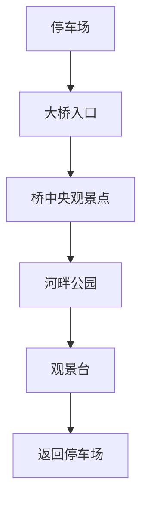
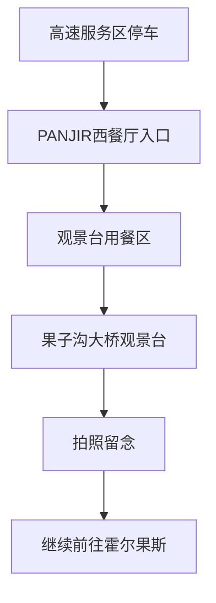
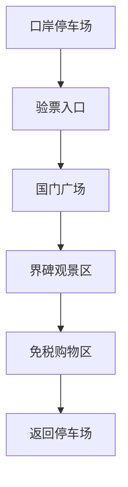
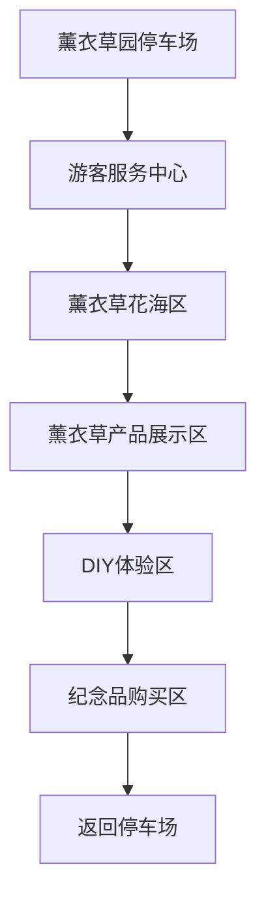

# 第五天 - 2025年7月1日 - 博乐→伊宁，重回伊犁河谷

## 📅 基本信息
- **日期**：2025年7月1日（星期二）
- **天气**：晴转多云（20°C - 28°C）
- **主题**：回归文明、历史文化、河谷风光
- **住宿**：伊宁吉宜酒店（北京路商圈，地理位置优越）

## ⏰ 详细时间线

```mermaid
gantt
    title 第五天行程安排
    dateFormat  HH:mm
    axisFormat %H:%M
    section 上午
    艾莎江烤包子早餐  :07:30, 08:30
    博乐特产购买      :08:30, 09:30
    前往果子沟大桥    :09:30, 10:30
    PANJIR西餐厅早茶  :10:30, 11:30
    前往霍尔果斯      :11:30, 12:30
    霍尔果斯口岸游览  :12:30, 14:00
    section 下午
    前往薰衣草园      :14:00, 15:00
    解忧公主薰衣草园  :15:00, 17:00
    前往伊宁          :17:00, 18:00
    section 晚上
    维吾尔晚餐        :18:00, 19:30
    伊犁河大桥观光    :19:30, 20:30
    夜市漫步          :20:30, 22:00
```

| 时间 | 活动 | 地点 | 预计费用 | 备注 |
|------|------|------|----------|------|
| 07:30-08:30 | 🥟 早餐 | 艾莎江达吾提烤包子店 | ¥25-40 | 博乐酒店到餐厅约1公里/步行15分钟 |
| 08:30-09:30 | 🛍️ 特产购买 | 博乐市区 | ¥160-250 | 距离：待查 |
| 09:30-10:30 | 🚗 前往果子沟大桥 | G30高速 | ¥40-50 | 博乐到果子沟大桥约60公里/1小时 |
| 10:30-11:30 | ☕ 早茶休憩 | PANJIR西餐厅 | ¥80-120 | 果子沟大桥观景台旁，步行1分钟 |
| 11:30-12:30 | 🚗 前往霍尔果斯 | G312国道 | ¥30-40 | 果子沟大桥到霍尔果斯约50公里/1小时 |
| 12:30-14:00 | 🏛️ 口岸游览 | 霍尔果斯口岸 | ¥50-80 | 距离：待查 |
| 14:00-15:00 | 🚗 前往薰衣草园 | 省道218 | ¥30-40 | 霍尔果斯到解忧公主薰衣草园约50公里/1小时 |
| 15:00-17:00 | 🌸 薰衣草花海 | 解忧公主薰衣草园 | ¥50-200 | 距离：待查 |
| 17:00-18:00 | 🚗 前往伊宁 | G218国道 | ¥40-60 | 解忧公主薰衣草园到伊宁约60公里/1小时 |
| 18:00-19:30 | 🍽️ 晚餐 | 维吾尔餐厅 | ¥133-220 | 距离：待查 |
| 19:30-20:30 | 🌉 河桥观光 | 伊犁河大桥 | ¥0 | 餐厅到大桥约3公里/10分钟车程 |
| 20:30-22:00 | 🌃 夜生活 | 伊犁河公园/夜市 | ¥95-175 | 大桥到夜市约2公里/步行25分钟 |

## 🎯 主要景点详情

### 景点A：伊犁河大桥

**基本信息**
- 📍 **地址**：伊宁市伊犁河上
- ⏰ **开放时间**：全天开放
- 🎫 **门票价格**：免费
- 🚗 **停车费用**：免费
- 📞 **联系电话**：伊宁旅游咨询 0999-8139777

**推荐活动**
- [ ] 河桥建筑摄影
- [ ] 伊犁河风光拍摄
- [ ] 河畔公园散步
- [ ] 观赏城市全景

**游览路线**

**实用提示**
- 💡 建议游览时间：1小时
- 🚻 洗手间位置：河畔公园内
- 📸 最佳拍摄时间：16:00-17:00
- 🌉 桥上风大，注意保暖

### 景点B：汉人街历史街区

**基本信息**
- 📍 **地址**：伊宁市汉人街道
- ⏰ **开放时间**：09:00-18:00
- 🎫 **门票价格**：免费参观
- 🚗 **停车情况**：¥5/小时
- 📞 **联系电话**：0999-8139777

**推荐活动**
- [ ] 参观清代建筑群
- [ ] 了解伊犁开发历史
- [ ] 购买传统手工艺品
- [ ] 参观伊犁历史博物馆

### 景点C：PANJIR西餐厅·果子沟大桥观景点（途经点）

**基本信息**
- 📍 **地址**：果子沟大桥观景台旁，G30连霍高速果子沟段
- ⏰ **营业时间**：08:00-20:00
- 🎫 **消费价格**：¥80-150/人（早茶轻食套餐）
- 🚗 **停车费用**：免费停车
- 📞 **联系电话**：0909-3361888

**推荐活动**
- [ ] 在观景台俯瞰果子沟大桥壮观景色
- [ ] 品尝精致的早茶和欧式轻食
- [ ] 欣赏天山北坡的壮美风光
- [ ] 拍摄果子沟大桥全景照片
- [ ] 体验高原咖啡厅的休闲氛围

**游览路线**

**实用提示**
- 💡 建议用餐时间：1小时
- 🚻 洗手间位置：餐厅内部
- 📸 最佳拍摄时间：10:30-11:30（上午光线最佳）
- 🌉 果子沟大桥是新疆最美高架桥之一
- ☕ 早茶套餐性价比高，推荐尝试

### 景点D：霍尔果斯口岸（途经点）

**基本信息**
- 📍 **地址**：霍尔果斯市312国道，中哈边境口岸
- ⏰ **开放时间**：09:00-17:30（周一至周日）
- 🎫 **门票价格**：景区门票¥30/人，观光车¥20/人
- 🚗 **停车费用**：¥10/次（4小时内）
- 📞 **联系电话**：0999-8765432

**推荐活动**
- [ ] 参观中哈国界线和界碑
- [ ] 体验"一脚踏两国"的独特感受
- [ ] 观赏雄伟的国门建筑
- [ ] 在中哈边境合影留念
- [ ] 参观口岸博物馆，了解丝绸之路历史

**游览路线**

**实用提示**
- 💡 建议游览时间：1-1.5小时
- 🚻 洗手间位置：国门广场内
- 📸 最佳拍摄时间：14:00-15:00（阳光充足）
- 📋 **重要提醒**：需携带身份证件，外国游客需要护照
- 🛍️ 免税店有哈萨克斯坦特产，价格相对优惠

### 景点E：解忧公主薰衣草园（途经点）

**基本信息**
- 📍 **地址**：伊犁州霍城县芦草沟镇四宫村
- ⏰ **开放时间**：08:00-20:00（6-8月薰衣草花期）
- 🎫 **门票价格**：¥35/人，观光车¥15/人
- 🚗 **停车费用**：免费停车
- 📞 **联系电话**：0999-3229988

**推荐活动**
- [ ] 漫步紫色薰衣草花海
- [ ] 体验薰衣草精油制作工艺
- [ ] 品尝薰衣草蜂蜜和薰衣草茶
- [ ] 购买薰衣草系列产品
- [ ] 在花海中拍摄浪漫写真

**游览路线**

**实用提示**
- 💡 建议游览时间：1.5-2小时
- 🚻 洗手间位置：游客服务中心内
- 📸 最佳拍摄时间：15:30-17:00（夕阳西下时）
- 🌸 **最佳花期**：6月下旬-7月中旬（7月1日正值盛花期）
- 🧴 薰衣草精油产品价格：¥25-180不等

## 🍽️ 美食推荐

### 早餐推荐

| 餐厅名称 | 招牌菜品 | 价格范围 | 距离住宿 | 评分 |
|----------|----------|----------|----------|------|
| 艾莎江达吾提烤包子店 | 羊肉烤包子、奶茶 | ¥25-40 | 博乐出发前 | ⭐⭐⭐⭐⭐ |
| 博乐早餐店 | 包子、豆浆 | ¥15-30 | 博乐酒店内 | ⭐⭐⭐⭐ |

### 住宿推荐 - 伊宁吉宜酒店

**酒店信息**
- 📍 **地址**：伊宁市北京路1979号
- ⏰ **入住时间**：15:00，退房时间：12:00
- 🎫 **房价范围**：¥258-398/晚
- 🚗 **停车情况**：免费停车场
- 📞 **联系电话**：0999-8135222

**酒店特色**
- 🏨 **经济型酒店**：北京路商圈，地理位置优越
- 🛏️ **舒适客房**：干净整洁，基础设施完善
- 🍳 **中式早餐**：传统早餐，价格实惠
- 📶 **便利设施**：免费WiFi，24小时前台服务

### 早茶推荐 - PANJIR西餐厅·果子沟大桥观景点

**餐厅信息**
- 📍 **地址**：果子沟大桥观景台旁，G30连霍高速果子沟段
- ⏰ **营业时间**：08:00-20:00
- 💰 **价格范围**：¥80-150/人（早茶轻食套餐）
- 🚗 **停车情况**：免费停车场
- 📞 **预订电话**：0909-3361888

**特色亮点**
- 🌉 **果子沟大桥观景**：俯瞰新疆最美高架桥全景
- ☕ **精品早茶**：现磨咖啡、英式早茶、法式糕点
- 🏔️ **天山风光**：欣赏天山北坡壮美景色
- 🥐 **欧式轻食**：牛角包、三明治、沙拉
- 🏡 **高原咖啡厅**：温馨欧式装修，海拔1000米的独特体验
- 🚗 **交通便利**：位于高速公路旁，绝佳观景位置

**推荐菜品**
| 菜品名称 | 价格 | 特色 | 推荐指数 |
|----------|------|------|----------|
| 果子沟早茶套餐 | ¥98 | 咖啡+牛角包+果酱 | ⭐⭐⭐⭐⭐ |
| 意式拿铁咖啡 | ¥35 | 现磨咖啡豆，奶泡拉花 | ⭐⭐⭐⭐⭐ |
| 法式可颂三明治 | ¥58 | 火腿芝士可颂配沙拉 | ⭐⭐⭐⭐ |
| 英式司康饼 | ¥28 | 配黄油和草莓果酱 | ⭐⭐⭐⭐ |
| 天山蜂蜜柠檬茶 | ¥25 | 本地蜂蜜配新鲜柠檬 | ⭐⭐⭐⭐⭐ |

### 晚餐推荐
| 餐厅名称 | 菜系类型 | 人均消费 | 环境特色 | 推荐指数 |
|----------|----------|----------|----------|----------|
| 老城维族餐厅 | 维吾尔菜 | ¥120-200 | 传统装修 | ⭐⭐⭐⭐⭐ |
| 伊犁美食城 | 新疆菜 | ¥80-150 | 品种丰富 | ⭐⭐⭐⭐ |

## 🚗 交通与加油信息

### 景点间交通

### 推荐加油站
| 加油站名称 | 位置 | 油品价格 | 服务设施 |
|------------|------|----------|----------|
| 博乐中石油 | 博乐市区 | 92#: ¥7.2/升 | 便利店、洗手间 |
| 精河中石化 | 精河县城 | 95#: ¥7.8/升 | 餐厅、休息区 |

### 停车信息
- **伊犁河大桥**：免费停车，可停车50辆
- **汉人街**：¥5/小时，可停车30辆
- **夜市区域**：¥10/次，可停车100辆

## 💰 当日预算明细

| 项目 | 预算金额 | 实际花费 | 节省/超支 |
|------|----------|----------|-----------|
| 交通费 | ¥180 | ¥___ | ¥___ |
| 门票费 | ¥130 | ¥___ | ¥___ |
| 餐饮费 | ¥300 | ¥___ | ¥___ |
| 购物费 | ¥300 | ¥___ | ¥___ |
| 其他费用 | ¥60 | ¥___ | ¥___ |
| **总计** | **¥970** | **¥___** | **¥___** |

## 📝 旅行小贴士

### 🎒 今日必备物品
- [ ] 相机/手机充电宝
- [ ] 防晒霜、遮阳帽
- [ ] 舒适的行走鞋
- [ ] 身份证件
- [ ] 现金和银行卡
- [ ] 保温水杯

### ⚠️ 注意事项
- 🕐 全程约280公里，比原计划增加80公里，注意安全驾驶
- 📋 霍尔果斯口岸需携带身份证件，外国游客需要护照
- 🌸 薰衣草园7月1日正值盛花期，建议多拍照留念
- 💊 长途驾驶注意休息，避免疲劳驾驶
- 🧴 伊宁市昼夜温差较大，准备外套
- 👥 夜市人多，注意保管好个人物品
- 🛍️ 薰衣草产品种类丰富，注意辨别质量和价格

### 📸 拍照推荐
- **最佳拍照时间**：上午10:30-11:30（果子沟大桥），下午15:00-17:00（薰衣草园）
- **推荐拍照地点**：
  - 果子沟大桥观景台：新疆最美高架桥全景、天山北坡风光
  - 霍尔果斯口岸：国门建筑、界碑合影、"一脚踏两国"
  - 解忧公主薰衣草园：紫色花海、田园风光、浪漫写真
  - 伊犁河大桥：河流风光、城市全景
  - 夜市：人文风情、美食小摊

## 🌟 今日亮点回顾
- [ ] 品尝到艾莎江达吾提烤包子店的正宗美味
- [ ] 购买到优质的博乐特产
- [ ] 在果子沟大桥观景台俯瞰新疆最美高架桥全景
- [ ] 在PANJIR西餐厅享受高原早茶和天山风光
- [ ] 体验"一脚踏两国"的独特感受，在霍尔果斯口岸留念
- [ ] 参观中哈边境界碑，了解丝绸之路历史文化
- [ ] 在解忧公主薰衣草园漫步紫色花海
- [ ] 体验薰衣草精油制作工艺，购买薰衣草产品
- [ ] 欣赏到伊犁河的壮美风光
- [ ] 品尝到正宗的维吾尔族美食
- [ ] 体验伊宁夜生活的丰富多彩

---

**下一天预告**：明天我们将在伊宁市区深度游，重点体验多元文化和民族风情！

*制作时间：2025年7月1日*  
*您的专属旅行导游：Cursor* 🗺️✨ 