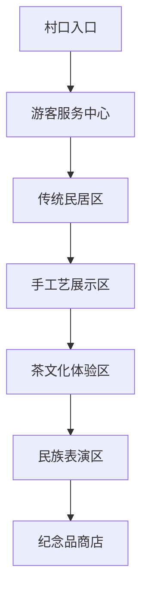

# 第六天 - 2025年7月2日 - 伊宁市区深度游，多元文化体验

## 📅 基本信息
- **日期**：2025年7月2日（星期三）
- **天气**：晴（21°C - 29°C），微风
- **主题**：文化体验、休闲放松、民族风情
- **住宿**：伊宁喆啡酒店

## ⏰ 详细时间线

```mermaid
gantt
    title 第六天行程安排
    dateFormat  HH:mm
    axisFormat %H:%M
    section 上午
    酒店早餐           :08:00, 08:40
    六星街美食体验    :08:40, 09:30
    喀赞其民俗村      :09:40, 12:00
    section 下午
    老城区午餐        :12:00, 13:30
    林则徐纪念馆      :13:40, 14:30
    伊犁将军府        :14:40, 15:30
    人民公园          :15:40, 16:30
    薰衣草基地        :16:30, 18:30
    section 晚上
    夜市晚餐          :19:00, 20:00
    河畔夜景          :20:00, 21:30
```

| 时间 | 活动 | 地点 | 预计费用 | 距离/交通 | 备注 |
|------|------|------|----------|-----------|------|
| 08:00-08:40 | 🍳 早餐 | 喆啡酒店餐厅 | ¥50-80 | 酒店内 | 悠闲享用自助早餐 |
| 08:40-09:30 | 🍦 六星街美食 | 六星街 | ¥30-60 | 步行约300米/5分钟 | 古兰丹姆冰淇淋、蓝墙面肺子 |
| 09:40-12:00 | 🏘️ 民俗村游览 | 喀赞其民俗村 | ¥80-150 | 车程约3公里/10分钟 | 维吾尔族文化体验 |
| 12:00-13:30 | 🍜 午餐 | 老城区餐厅 | ¥133-203 | 步行约1公里/15分钟 | 传统维族美食 |
| 13:40-14:30 | 📚 历史学习 | 林则徐纪念馆 | ¥20-30 | 车程约2公里/8分钟 | 了解边疆历史 |
| 14:40-15:30 | 🏛️ 古建参观 | 伊犁将军府 | ¥25-35 | 步行约800米/10分钟 | 清代军政文化 |
| 15:40-16:30 | 🌳 公园休闲 | 人民公园 | ¥15-30 | 车程约2公里/8分钟 | 观察当地生活 |
| 16:30-18:30 | 💜 薰衣草园 | 霍城薰衣草基地 | ¥80-150 | 车程约25公里/30分钟 | 紫色花海摄影 |
| 19:00-20:00 | 🍢 夜市晚餐 | 伊宁夜市 | ¥115-185 | 车程约5公里/15分钟 | 特色小食品尝 |
| 20:00-21:30 | 🌃 夜景漫步 | 伊犁河公园 | ¥0-30 | 步行约1公里/15分钟 | 河畔夜景摄影 |

## 🎯 主要景点详情

### 景点A：喀赞其民俗村

**基本信息**
- 📍 **地址**：伊宁市喀赞其街道办事处
- ⏰ **开放时间**：09:00-19:00
- 🎫 **门票价格**：¥30/人
- 🚗 **停车费用**：免费
- 📞 **联系电话**：0999-8024566

**推荐活动**
- [ ] 参观维吾尔族传统民居
- [ ] 观看手工艺制作过程
- [ ] 品尝传统维族茶文化
- [ ] 欣赏民族歌舞表演

**游览路线**

**实用提示**
- 💡 建议游览时间：2.5小时
- 🚻 洗手间位置：服务中心、中部展示区
- 🎭 表演时间：10:30、14:30、16:30
- 📸 拍照需征得居民同意

### 景点B：霍城薰衣草基地

**基本信息**
- 📍 **地址**：霍城县芦草沟镇四宫村
- ⏰ **开放时间**：08:00-20:00
- 🎫 **门票价格**：¥40/人
- 🚗 **停车情况**：免费停车场
- 📞 **联系电话**：0999-3022888

**推荐活动**
- [ ] 紫色花海摄影
- [ ] 薰衣草精油体验
- [ ] 薰衣草产品购买
- [ ] 田园风光拍摄

### 景点C：六星街美食文化街区

**基本信息**
- 📍 **地址**：伊宁市六星街
- ⏰ **开放时间**：全天（美食店铺多为10:00-22:00）
- 🎫 **门票价格**：免费
- 🚗 **停车情况**：周边有公共停车场

**推荐体验**
- [ ] 漫步六星街，感受伊宁多元文化氛围
- [ ] 打卡蓝墙面肺子、古兰丹姆百年古法冰淇淋等地道美食
- [ ] 拍摄蓝色墙面与民族风情街景
- [ ] 购买特色小吃和手工艺品

**美食打卡**
- 🍦 **古兰丹姆百年古法冰淇淋**：新疆老字号，手工搅拌，奶香浓郁，夏日必尝
- 🫓 **蓝墙面肺子**：六星街地标美食，牛杂配秘制辣酱，色香味俱全

**实用提示**
- 💡 建议游览时间：1小时
- 📸 蓝墙、冰淇淋摊位是热门拍照点
- 🕒 下午或傍晚人气最旺

## 🍽️ 美食推荐

### 早餐推荐
| 餐厅名称 | 招牌菜品 | 价格范围 | 距离酒店 | 评分 |
|----------|----------|----------|----------|------|
| 喆啡酒店餐厅 | 中西式自助早餐 | ¥58-88 | 酒店内 | ⭐⭐⭐⭐⭐ |
| 清真早餐店 | 牛肉面、包子 | ¥20-35 | 步行5分钟 | ⭐⭐⭐⭐ |

**喆啡酒店早餐特色**
- 🥐 **西式餐品**：面包、牛角包、果酱、咖啡
- 🥛 **中式餐品**：小米粥、豆浆、包子、咸菜
- 🥗 **健康选择**：新鲜沙拉、水果、酸奶
- ⏰ **供应时间**：07:00-10:00

### 午餐推荐

| 餐厅名称 | 招牌菜品 | 价格范围 | 特色 | 预订电话 |
|----------|----------|----------|------|----------|
| 老城区抓饭王 | 羊肉抓饭、拉条子 | ¥60-100 | 百年老店 | 0999-XXXX |
| 新疆人家 | 大盘鸡、烤肉 | ¥80-150 | 地道风味 | 0999-XXXX |

### 六星街美食推荐
| 餐厅/摊位 | 招牌美食 | 价格 | 特色 | 推荐指数 |
|------------|----------|------|------|----------|
| 古兰丹姆百年古法冰淇淋 | 手工冰淇淋 | ¥15-25 | 百年老字号，奶香浓郁 | ⭐⭐⭐⭐⭐ |
| 蓝墙面肺子 | 面肺子 | ¥18-28 | 牛杂配辣酱，蓝墙打卡 | ⭐⭐⭐⭐⭐ |

### 晚餐推荐
| 餐厅名称 | 菜系类型 | 人均消费 | 环境特色 | 推荐指数 |
|----------|----------|----------|----------|----------|
| 伊宁夜市 | 特色小食 | ¥80-120 | 热闹氛围 | ⭐⭐⭐⭐⭐ |
| 河畔餐厅 | 新疆菜 | ¥100-180 | 河景环境 | ⭐⭐⭐⭐ |

## 🚗 交通与加油信息

### 景点间交通

### 推荐加油站
| 加油站名称 | 位置 | 油品价格 | 服务设施 |
|------------|------|----------|----------|
| 市区中石油 | 伊宁市中心 | 92#: ¥7.2/升 | 便利店、洗手间 |
| 霍城加油站 | 薰衣草基地附近 | 95#: ¥7.8/升 | 休息区 |

### 停车信息
- **喀赞其民俗村**：免费停车，可停车100辆
- **人民公园**：¥5/小时，可停车80辆
- **薰衣草基地**：免费停车，可停车200辆

## 💰 当日预算明细

| 项目 | 预算金额 | 实际花费 | 节省/超支 |
|------|----------|----------|-----------|
| 交通费 | ¥60 | ¥___ | ¥___ |
| 门票费 | ¥100 | ¥___ | ¥___ |
| 餐饮费 | ¥280 | ¥___ | ¥___ |
| 购物费 | ¥200 | ¥___ | ¥___ |
| 其他费用 | ¥50 | ¥___ | ¥___ |
| **总计** | **¥690** | **¥___** | **¥___** |

## 📝 旅行小贴士

### 🎒 今日必备物品
- [ ] 相机/手机充电宝
- [ ] 防晒霜、遮阳帽
- [ ] 舒适的行走鞋
- [ ] 身份证件
- [ ] 现金和银行卡
- [ ] 浅色衣服（薰衣草拍照）

### ⚠️ 注意事项
- 🎭 参与民族歌舞时尊重当地风俗
- 📸 拍摄当地人需征得同意
- 🛍️ 购买手工艺品可适当砍价
- 💜 薰衣草基地花田中蜜蜂较多，注意防护
- 👥 夜市人多，注意保管好个人物品

### 📸 拍照推荐
- **最佳拍照时间**：上午10:00-11:00，下午17:00-19:00
- **推荐拍照地点**：
  - 喀赞其民俗村：传统民居、手工艺制作
  - 薰衣草基地：紫色花海、田园风光
  - 伊犁河畔：夜景、倒影
- **最佳拍照时间**：下午17:30-18:30（六星街蓝墙、冰淇淋摊位）
- **推荐拍照地点**：
  - 六星街蓝墙：民族风情、特色美食
  - 古兰丹姆冰淇淋摊：手工冰淇淋制作

## 🌟 今日亮点回顾
- [ ] 深度体验维吾尔族传统文化
- [ ] 学习了伊犁的历史文化知识
- [ ] 在薰衣草花海中拍摄美照
- [ ] 品尝到地道的维族美食
- [ ] 购买到优质的薰衣草制品
- [ ] 感受到伊宁多元文化的魅力
- [ ] 漫步六星街，打卡蓝墙和百年冰淇淋
- [ ] 品尝地道面肺子和手工冰淇淋

---

**下一天预告**：明天我们将前往神秘的特克斯八卦城，重点体验世界独一无二的八卦城市布局！

*制作时间：2025年7月2日*  
*您的专属旅行导游：Cursor* 🗺️✨ 