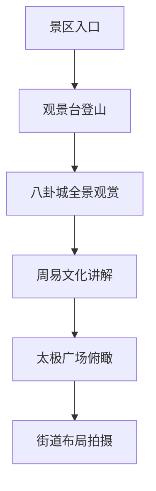

# 第九天 - 2025年7月5日 - 那拉提→特克斯八卦城，神秘布局探索

## 📅 基本信息
- **日期**：2025年7月5日（星期六）
- **天气**：晴转多云（18°C - 26°C），山区气候
- **主题**：八卦城探秘、易经文化、历史传说
- **住宿**：全季酒店特克斯八卦城太极坛店

## ⏰ 详细时间线

| 时间 | 活动 | 地点 | 费用 | 距离/交通 | 备注 |
|------|------|------|------|-----------|------|
| 08:00-09:00 | 🏨 酒店退房 | 那拉提丽呈酒店 | - | - | 整理行李，酒店早餐 |
| 09:00-12:00 | 🚗 前往特克斯 | 那拉提→特克斯 | ¥98过路费 | 距离：252公里，3小时4分钟 | 墩那高速→G577→S220 |
| 12:00-13:30 | 🍽️ 午餐休息 | 八卦城美食广场 | ¥80-120 | 距离：市中心 | 品尝当地特色美食 |
| 13:30-14:00 | 🏨 酒店入住 | 皇冠假日酒店 | ¥450-600 | 距离：美食广场步行5分钟 | 办理入住，稍作休息 |
| 14:00-17:30 | 🎯 八卦城探索 | 特克斯八卦城 | ¥60-100 | 距离：酒店步行可达 | 世界最大八卦城 |
| 17:30-19:00 | 🌄 太极坛观景 | 八卦城太极坛 | ¥30-50 | 距离：八卦城中心步行10分钟 | 俯瞰八卦城全景 |
| 19:00-20:30 | 🥘 特色晚餐 | 皇冠假日餐厅 | ¥200-300 | 距离：酒店内 | 哈萨克族风味大餐 |
| 20:30-22:00 | 🎭 文化表演 | 八卦城文化广场 | ¥80-120 | 距离：酒店步行8分钟 | 易经文化表演 |

## 🎯 主要景点详情

### 景点A：特克斯八卦城观景台

**基本信息**
- 📍 **地址**：特克斯县离街观景台
- ⏰ **开放时间**：08:00-22:00
- 🎫 **门票价格**：¥50/人，观光车¥20/人
- 🚗 **停车费用**：免费停车
- 📞 **联系电话**：0999-3622888

**推荐活动**
- [ ] 俯瞰世界最大八卦城布局
- [ ] 拍摄64卦街道排列
- [ ] 观赏太极中心广场
- [ ] 体验易经文化魅力

**游览路线**

**实用提示**
- 💡 建议游览时间：2-3小时
- 🚻 洗手间位置：入口、观景台
- 📸 最佳拍摄时间：14:00-16:00、19:00-20:30
- 🚠 建议乘坐观光车上山

### 景点B：特克斯八卦博物馆

**基本信息**
- 📍 **地址**：特克斯县太极广场旁
- ⏰ **开放时间**：09:00-18:00（周一闭馆）
- 🎫 **门票价格**：¥30/人，学生半价
- 🚗 **停车情况**：免费停车
- 📞 **联系电话**：0999-3621999

**推荐活动**
- [ ] 学习易经八卦知识
- [ ] 了解特克斯历史
- [ ] 观看3D城市规划展示
- [ ] 体验太极文化

## 🍽️ 美食推荐

### 早餐推荐 - 璞玥酒店告别早餐

| 餐厅名称 | 招牌菜品 | 价格范围 | 距离住宿 | 评分 |
|----------|----------|----------|----------|------|
| 璞玥酒店餐厅 | 告别草原早餐 | ¥68-98 | 酒店内 | ⭐⭐⭐⭐⭐ |
| 那拉提镇餐厅 | 路早餐 | ¥25-40 | 途中 | ⭐⭐⭐ |

### 午餐推荐 - 特克斯县城

| 餐厅名称 | 招牌菜品 | 价格范围 | 特色 | 预订电话 |
|----------|----------|----------|------|----------|
| 八卦城餐厅 | 哈萨克拌面、烤肉 | ¥60-100 | 县城特色 | 0999-3621000 |
| 太极餐厅 | 风味套餐 | ¥80-120 | 文化主题 | 0999-3621888 |

### 晚餐推荐 - 特克斯特色美食

| 餐厅名称 | 菜系类型 | 人均消费 | 环境特色 | 推荐指数 |
|----------|----------|----------|----------|----------|
| 八卦楼餐厅 | 哈萨克菜 | ¥180-250 | 八卦主题装修 | ⭐⭐⭐⭐⭐ |
| 草原风情园 | 新疆菜 | ¥120-180 | 庭院风格 | ⭐⭐⭐⭐ |

**特克斯特色菜单**
- 🥩 **哈萨克手抓羊肉**：¥198/份（3-4人份）
- 🍖 **特克斯烤肉串**：¥8/串，推荐羊肉串
- 🥛 **马奶酒**：¥48/壶，当地特产
- 🍯 **特克斯蜂蜜**：¥58/瓶，伴手礼首选

## 🚗 交通与加油信息

### 景点间交通

**详细路线**
1. 从那拉提璞玥酒店出发
2. 经过巩乃斯河谷，沿途风景优美
3. 翻越山路，约2.5小时到达特克斯
4. 进入世界最大的八卦城

### 推荐加油站
| 加油站名称 | 位置 | 油品价格 | 服务设施 |
|------------|------|----------|----------|
| 那拉提镇加油站 | 出发必经 | 92#: ¥7.5/升 | 便利店、洗手间、餐厅 |
| 途中服务区 | 山路中段 | 95#: ¥8.1/升 | 休息区、简餐 |
| 特克斯中石油 | 县城入口 | 92#: ¥7.3/升 | 便利店、修理服务 |

### 停车信息
- **太极广场**：免费停车，可停车150辆
- **观景台**：¥10/次，可停车80辆
- **八卦博物馆**：免费停车，可停车50辆
- **县城酒店**：酒店客人免费停车

## 💰 当日预算明细

| 项目 | 预算金额 | 实际花费 | 节省/超支 |
|------|----------|----------|-----------|
| 油费过路费 | ¥120 | ¥___ | ¥___ |
| 门票费用 | ¥120 | ¥___ | ¥___ |
| 餐饮费用 | ¥380 | ¥___ | ¥___ |
| 住宿费用 | ¥320 | ¥___ | ¥___ |
| 购物费用 | ¥150 | ¥___ | ¥___ |
| 其他费用 | ¥100 | ¥___ | ¥___ |
| **总计** | **¥1,190** | **¥___** | **¥___** |

## 📝 旅行小贴士

### 🎒 今日必备物品
- [ ] 相机/手机充电宝
- [ ] 轻便外套（山区温差适中）
- [ ] 舒适的行走鞋
- [ ] 身份证件
- [ ] 现金和银行卡
- [ ] 山路驾驶必需品

### ⚠️ 注意事项
- 🏔️ 山路较多，弯道较多，注意安全驾驶
- 🌡️ 山区气候变化快，准备保暖衣物
- 🚗 下坡路段控制车速，急弯处小心会车
- 🎭 特克斯是哈萨克族聚居区，尊重当地风俗
- 👥 太极广场无红绿灯，注意交通安全
- 📖 可提前了解一些易经八卦知识

### 📸 拍照推荐
- **最佳拍照时间**：上午10:00-11:00，下午14:00-16:00
- **推荐拍照地点**：
  - 观景台：八卦城全景、64卦街道布局
  - 太极广场：中心太极图案、八卦街道放射
  - 博物馆：易经文化展示、八卦文物

## 🏨 住宿详情

### 全季酒店特克斯八卦城太极坛店

**酒店信息**
- 📍 **地址**：特克斯县太极广场西侧，八卦城中心位置
- ⭐ **等级**：中档商务酒店，全季品牌连锁
- 💰 **价格**：¥280-380/间（标准间）
- 📞 **联系电话**：0999-3623888
- 🏪 **品牌特色**：华住集团旗下，简约现代设计

**房型配置**
- 🛏️ **标准间**：2张1.2米单床或1张1.8米双人床
- 🚿 **设施**：独立卫浴、空调、WiFi、电视
- 🪟 **景观**：部分房间可看太极广场夜景
- 🅿️ **停车**：酒店免费停车场，可停50辆车

**酒店优势**
- ✅ 位于八卦城核心区，步行到太极广场仅2分钟
- ✅ 全国连锁品牌，服务标准化，卫生条件好
- ✅ 房间设计简约舒适，商务出行首选
- ✅ 楼下就有便利店和餐厅，生活便利
- ✅ 前台24小时服务，可协助景点咨询

**特殊服务**
- 🎯 可提供八卦城文化讲解资料
- 🚗 免费提供周边停车指引
- 🍳 早餐可选（¥58/人），新疆特色粥品
- 📋 前台可协助预订明日返程路线

## 🌟 今日亮点回顾
- [ ] 告别美丽的那拉提草原和璞玥酒店
- [ ] 完成从那拉提到特克斯的山路驾驶
- [ ] 俯瞰了世界最大的八卦城布局
- [ ] 学习了易经文化和八卦知识
- [ ] 体验了哈萨克族传统美食
- [ ] 感受到中华传统文化的神奇魅力
- [ ] 入住全季酒店，体验品牌化服务

---

**明日预告**：明天我们将从特克斯前往伊宁市，购买特产纪念品，为旅程的圆满结束做准备！

*制作时间：2025年7月5日*  
*您的专属旅行导游：Cursor* 🗺️✨ 