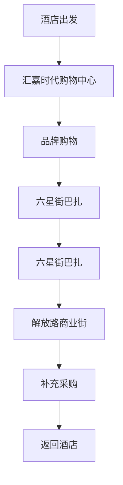

# 第十天 - 2025年7月6日 - 那拉提→伊宁，休闲购物

## 📅 基本信息
- **日期**：2025年7月6日（星期日）
- **天气**：晴（20°C - 28°C）
- **主题**：返回伊宁、购物休闲、行程总结
- **住宿**：伊宁伊犁宾馆

## 📍 目的地概况
**从那拉提草原返回伊宁市** - 告别草原，回到城市
- 早晨告别美丽的那拉提草原
- 驾车返回伊犁哈萨克自治州首府伊宁市
- 在伊宁市进行最后的购物和休闲
- 为明日返程做好准备

## ⏰ 详细时间线

| 时间 | 活动安排 | 地点 | 备注 | 距离： |
|------|----------|------|------|--------|
| 08:00-09:00 | 早餐，退房 | 特克斯县城酒店 | 打包行李，告别八卦城 | 酒店内 |
| 09:00-12:30 | 驾车返回伊宁 | 特克斯→伊宁 | 约120公里，2.5小时 | 距离：待查 |
| 12:30-13:30 | 入住酒店，午餐 | 伊宁伊犁宾馆 | 四星级酒店，休息调整 | 距离：待查 |
| 13:30-16:00 | 购物中心 | 汇嘉时代购物中心 | **主要活动** | 酒店到商场约3公里/10分钟车程 |
| 16:00-17:30 | 民族特产市场 | 六星街巴扎 | 特产采购 | 商场到巴扎约2公里/步行25分钟 |
| 17:30-19:00 | 市区观光 | 伊犁河大桥 | 城市风光 | 巴扎到大桥约3公里/10分钟车程 |
| 19:00-20:30 | 告别晚餐 | 特色餐厅 | 总结旅程 | 大桥到餐厅约2公里/步行25分钟 |
| 20:30-22:00 | 酒店休息 | 伊宁伊犁宾馆 | 准备明日行程 | 餐厅到酒店约1公里/步行15分钟 |

## 🛍️ 购物指南

### 伊宁主要购物区域

| 购物区域 | 特色 | 主要商品 | 价格水平 | 推荐指数 |
|----------|------|----------|----------|----------|
| 汇嘉时代购物中心 | 现代商场 | 品牌服装、化妆品 | 中高端 | ⭐⭐⭐⭐ |
| 六星街巴扎 | 传统集市 | 民族工艺品、特产 | 中低端 | ⭐⭐⭐⭐⭐ |
| 解放路商业街 | 老牌商街 | 日用品、小商品 | 中等 | ⭐⭐⭐ |
| 新华东路 | 特产一条街 | 新疆特产、干果 | 中等 | ⭐⭐⭐⭐ |

### Mermaid 购物路线规划

## 🎁 新疆特产购买指南

### 必买特产清单

| 特产名称 | 价格范围 | 保质期 | 包装建议 | 推荐指数 |
|----------|----------|--------|----------|----------|
| 和田大枣 | 30-80元/斤 | 12个月 | 真空包装 | ⭐⭐⭐⭐⭐ |
| 新疆葡萄干 | 25-60元/斤 | 6个月 | 密封袋装 | ⭐⭐⭐⭐⭐ |
| 巴旦木 | 40-100元/斤 | 12个月 | 罐装 | ⭐⭐⭐⭐ |
| 核桃 | 35-90元/斤 | 12个月 | 袋装 | ⭐⭐⭐⭐ |
| 薰衣草精油 | 50-200元/瓶 | 24个月 | 避光包装 | ⭐⭐⭐⭐ |
| 伊犁蜂蜜 | 60-150元/瓶 | 24个月 | 玻璃瓶装 | ⭐⭐⭐⭐⭐ |
| 英吉沙小刀 | 80-500元/把 | 永久 | 专用刀盒 | ⭐⭐⭐⭐ |
| 和田玉饰品 | 200-5000元 | 永久 | 专用包装 | ⭐⭐⭐⭐ |

### 购买技巧和注意事项
1. **比价购买**：同类商品价格差异大，货比三家
2. **质量检查**：仔细检查包装、生产日期
3. **真伪辨别**：选择正规商家，索要发票
4. **保存方法**：了解保存条件，避免变质
5. **托运规定**：了解航空托运限制

### 干果类选购要点
#### 和田大枣
- **外观**：色泽红润，大小均匀
- **手感**：饱满有弹性，不干瘪
- **口感**：甜度适中，肉质厚实
- **包装**：真空包装最佳

#### 葡萄干
- **品种**：绿香妃、马奶子、红香妃
- **色泽**：自然色泽，不过分鲜艳
- **大小**：颗粒饱满，无破损
- **甜度**：天然甜味，无添加糖

## 🏨 住宿推荐

### 伊宁伊犁宾馆详细信息

| 项目 | 详情 |
|------|------|
| 🏛️ **酒店级别** | 四星级商务酒店 |
| 📍 **地址** | 伊宁市解放路168号（市中心位置） |
| 💰 **价格** | ¥388-588元/间夜 |
| 📞 **联系电话** | 0999-8012345 |
| 🚗 **距机场** | 约12公里，20分钟车程 |
| ⭐ **特色** | 历史悠久、新疆风情装修、大堂气派 |

#### 酒店设施
- **商务中心**：提供打印、传真、商务洽谈
- **中餐厅**：新疆风味菜系，可品尝正宗手抓饭
- **西餐厅**：国际化菜品，适合多元化口味
- **健身房**：现代化健身设备，24小时开放
- **停车场**：免费停车位，安全便利
- **免费WiFi**：全覆盖高速网络
- **洗衣服务**：当日取送，价格合理

#### 房型选择
| 房型 | 面积 | 价格 | 特色设施 |
|------|------|------|----------|
| 标准间 | 26㎡ | ¥388/间 | 基础设施齐全，性价比高 |
| 豪华间 | 32㎡ | ¥458/间 | 伊犁河景观，装修精美 |
| 商务套房 | 45㎡ | ¥588/间 | 独立会客区，商务设施 |

### 其他推荐酒店

| 酒店名称 | 星级 | 价格 | 距机场 | 特色服务 |
|----------|------|------|--------|----------|
| 伊宁机场宾馆 | ⭐⭐⭐ | 280元/间 | 5分钟 | 免费接送机 |
| 锦江之星 | ⭐⭐⭐ | 320元/间 | 10分钟 | 标准化服务 |
| 维也纳酒店 | ⭐⭐⭐⭐ | 380元/间 | 15分钟 | 欧式风格 |
| 汉庭酒店 | ⭐⭐⭐ | 260元/间 | 12分钟 | 经济实惠 |

### 预订建议
- **提前预订**：确保有房，价格优惠
- **接送机服务**：询问是否提供免费接送
- **退房时间**：确认退房时间，安排行程
- **行李寄存**：是否可以寄存行李

## 🍽️ 告别美食

### 伊犁宾馆餐厅推荐

#### 中餐厅 - 伊犁风味轩
| 特色 | 详情 |
|------|------|
| 🍽️ **招牌菜** | 正宗伊犁手抓饭、野山菌炖羊肉 |
| 💰 **人均消费** | 150-200元 |
| ⏰ **营业时间** | 11:30-14:00, 18:00-22:00 |
| 🎨 **环境特色** | 新疆民族装饰，优雅用餐环境 |
| 📞 **预订电话** | 0999-8012345转餐厅部 |

**推荐菜品**：
- 🍛 **伊犁手抓饭**（98元/份）：选用优质羊肉和胡萝卜，香味浓郁
- 🍲 **野山菌炖羊肉**（158元/份）：当地野生蘑菇与羊肉完美结合
- 🍖 **馕坑烤羊腿**（288元/份）：传统烹饪工艺，外酥内嫩
- 🥗 **伊犁天山雪莲**（68元/份）：当地特色凉菜，清热解腻

#### 西餐厅 - 丝路咖啡厅
| 特色 | 详情 |
|------|------|
| ☕ **主打** | 精品咖啡、西式简餐、下午茶 |
| 💰 **人均消费** | 80-120元 |
| ⏰ **营业时间** | 07:00-23:00（全天候服务） |
| 🎵 **氛围** | 轻音乐、舒适沙发、商务洽谈 |

### 市区推荐告别晚餐餐厅

| 餐厅名称 | 菜系 | 人均消费 | 特色菜品 | 环境 | 距酒店 |
|----------|------|----------|----------|------|--------|
| 伊犁风情园 | 新疆菜 | 120元 | 大盘鸡、抓饭 | 民族风情 | 步行5分钟 |
| 天山明珠 | 融合菜 | 150元 | 创意新疆菜 | 现代典雅 | 车程10分钟 |
| 草原人家 | 哈萨克菜 | 100元 | 手抓肉、马奶酒 | 传统毡房 | 步行8分钟 |
| 西域食府 | 清真菜 | 130元 | 羊肉串、馕坑肉 | 古典装修 | 车程5分钟 |

### 必点菜品推荐
1. **大盘鸡**（88-128元）：新疆代表菜，鸡肉鲜嫩配土豆
2. **手抓饭**（68-98元）：传统主食，营养丰富香味独特
3. **烤羊肉串**（5-8元/串）：经典小食，香味浓郁
4. **拌面**（28-38元）：新疆面食，口感劲道配菜丰富
5. **熏马肠**（78元/份）：哈萨克族特色，独特风味
6. **奶茶**（15-25元/壶）：餐后饮品，浓郁香甜

### 特色下午茶体验
#### 伊犁宾馆丝路咖啡厅
- **薰衣草蜂蜜拿铁**（35元）：当地薰衣草蜂蜜调制
- **新疆坚果拼盘**（58元）：巴旦木、核桃、葡萄干组合
- **玫瑰花茶**（28元）：当地玫瑰花制作，美容养颜
- **手工马卡龙**（68元/6个）：法式甜点配新疆风味

## 🏛️ 市区观光

### 伊宁市区景点

| 景点名称 | 门票 | 游览时间 | 特色 | 推荐指数 |
|----------|------|----------|------|----------|
| 伊犁河大桥 | 免费 | 30分钟 | 城市地标，河景 | ⭐⭐⭐⭐ |
| 林则徐纪念馆 | 20元 | 1小时 | 历史文化 | ⭐⭐⭐ |
| 伊犁将军府 | 25元 | 1小时 | 清代建筑 | ⭐⭐⭐ |
| 人民公园 | 免费 | 45分钟 | 休闲娱乐 | ⭐⭐⭐ |

### 城市风光摄影
#### 伊犁河大桥
- **最佳时间**：黄昏17:00-19:00
- **拍摄角度**：桥头观景台
- **构图要点**：大桥+河流+远山
- **特色**：现代化桥梁与自然风光结合

#### 市区夜景
- **拍摄地点**：高层建筑楼顶
- **设备建议**：三脚架必备
- **曝光设置**：长曝光拍摄车流
- **安全注意**：注意拍摄地点安全

## 💰 今日预算明细

| 项目 | 费用 | 说明 |
|------|------|------|
| 油费 | 100元 | 特克斯返回伊宁（距离更近） |
| 住宿 | 458元/间 | 伊宁伊犁宾馆豪华间 |
| 餐饮 | 220元/人 | 午餐+下午茶+晚餐 |
| 购物 | 500-2000元/人 | 特产和纪念品 |
| 市区交通 | 50元 | 出租车费 |
| 景点门票 | 45元/人 | 纪念馆+将军府 |
| 其他 | 50元/人 | 停车、小食等 |
| **合计** | **约1423-2923元/人** | 含大额购物 |

## 📦 行李打包指南

### 特产包装建议
1. **干果类**：密封袋分装，避免串味
2. **精油类**：原包装，用泡沫包裹
3. **工艺品**：软物包装，防止碰撞
4. **玉石类**：专用盒装，随身携带
5. **刀具类**：必须托运，不可随身

### 托运注意事项
- **重量限制**：普通舱20kg，超重需付费
- **禁运物品**：易燃易爆、管制刀具
- **贵重物品**：建议随身携带
- **包装要求**：包装完整，标识清楚

### 随身物品清单
- 身份证、机票、登机牌
- 手机、充电器、移动电源
- 现金、银行卡、支付工具
- 常用药品、个人用品
- 相机、镜头、存储卡

## ⚠️ 注意事项

### 购物防骗提醒
1. **价格陷阱**：避免过分便宜的商品
2. **质量问题**：仔细检查商品质量
3. **退换货**：了解退换货政策
4. **发票保存**：索要正规发票
5. **冷静消费**：避免冲动购买

### 交通安全
- **行李看管**：在公共场所注意行李
- **出租车**：选择正规出租车
- **步行安全**：注意交通和路况
- **时间安排**：预留充足时间

### 文化尊重
- **民族习俗**：尊重当地民族习俗
- **宗教信仰**：注意宗教场所礼仪
- **语言沟通**：耐心友善交流
- **环保意识**：保护城市环境

## 📱 实用信息

### 紧急联系
- **机场服务**：0999-8139999
- **出租车调度**：0999-8135555
- **紧急救助**：110/120
- **旅游投诉**：0999-8139315

### 机场服务
- **值机时间**：起飞前2小时
- **安检时间**：预留1小时
- **机场大巴**：30分钟一班
- **出租车**：约40-60元到市区

### 最后购物推荐
1. **伊犁特产专卖店**：品质保证
2. **机场免税店**：最后机会
3. **酒店小商店**：应急购买
4. **便利店**：日用品补充

## 🎊 旅程回顾

### 11天行程亮点总结
1. **自然风光**：赛里木湖、那拉提草原、巴音布鲁克
2. **文化体验**：哈萨克族、维吾尔族、蒙古族文化
3. **特色美食**：手抓饭、烤肉、奶制品
4. **摄影收获**：湖光山色、花海草原、人文风情
5. **温泉养生**：天泉温泉放松身心
6. **购物收获**：新疆特产、民族工艺品

### 珍贵回忆
- 赛里木湖的碧蓝如镜
- 薰衣草海的紫色浪漫
- 草原上的骏马奔腾
- 民族歌舞的热情奔放
- 美食的丰富多彩
- 人民的热情好客

## 🌟 明日安排
明天将告别美丽的伊犁，带着满满的回忆和收获返回大连，结束这次难忘的新疆之旅！记得早起，预留充足时间到达机场。