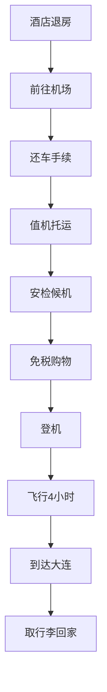

# 第十一天 - 2025年7月7日 - 返程大连

## 📅 基本信息
- **日期**：2025年7月7日（星期一）
- **天气**：晴（18°C - 26°C）
- **主题**：告别伊犁、返程大连、旅程结束
- **住宿**：返回大连

## 📍 行程概况
**返程日** - 告别新疆伊犁
- 机场还车办理手续
- 伊宁机场候机登机
- 飞行返回大连周水子国际机场
- 圆满结束11天新疆伊犁之旅

## ⏰ 详细时间线

| 时间 | 活动安排 | 地点 | 备注 | 距离： |
|------|----------|------|------|--------|
| 06:30-07:30 | 酒店早餐，最后整理 | 伊宁市区酒店 | 检查行李，退房 | 酒店内 |
| 07:30-08:00 | 前往机场 | 酒店→伊宁机场 | 约12公里，20分钟 | 距离：12公里，20分钟 |
| 08:00-09:00 | 租车还车手续 | 伊宁机场租车点 | **重要环节** | 距离：机场内 |
| 09:00-10:00 | 办理值机托运 | 伊宁机场 | 提前2小时 | 距离：机场内 |
| 10:00-11:00 | 安检候机 | 候机厅 | 休息等待 | 距离：机场内 |
| 11:00-11:30 | 最后购物 | 机场免税店 | 补充采购 | 距离：机场内 |
| 11:30-12:00 | 登机准备 | 登机口 | 检查登机牌 | 距离：机场内 |
| 12:00 | 起飞 | 伊宁→大连 | 约4小时飞行 | 距离：3200公里，4小时 |
| 17:00 | 到达大连 | 大连周水子机场 | 当地时间 | 距离：到达目的地 |
| 17:00-18:00 | 取行李，机场交通 | 大连机场 | 返回家中 | 距离：机场内 |

## ✈️ 航班信息

### 伊宁→大连航班
- **航班号**：根据实际预订确认
- **起飞时间**：12:00（预计）
- **到达时间**：17:00（预计）
- **飞行时长**：约4小时
- **时差**：新疆时间比北京时间晚2小时

### Mermaid 返程流程

## 🚗 租车还车流程

### 还车前检查清单
- [ ] **油箱**：加满油，保留加油小票
- [ ] **车身**：检查是否有新增划痕
- [ ] **内饰**：清理个人物品和垃圾
- [ ] **设备**：确认导航、充电器等齐全
- [ ] **证件**：准备身份证、驾驶证、租车合同

### 还车手续办理

| 步骤 | 内容 | 时间 | 注意事项 |
|------|------|------|----------|
| 1 | 车辆外观检查 | 10分钟 | 工作人员现场验车 |
| 2 | 油量确认 | 5分钟 | 确认满油还车 |
| 3 | 里程数记录 | 5分钟 | 核对总里程数 |
| 4 | 费用结算 | 10分钟 | 确认无额外费用 |
| 5 | 押金退还 | 15分钟 | 银行卡退还押金 |
| 6 | 票据保存 | 5分钟 | 保留还车凭证 |

### 可能产生的额外费用
- **超时费**：按小时计算
- **违章罚款**：由租车公司代缴
- **车损费用**：根据实际损坏程度
- **清洁费**：车内过于脏乱

## 🛄 行李托运指南

### 托运行李规定
- **重量限制**：经济舱通常20kg
- **尺寸限制**：长宽高之和不超过158cm
- **超重费用**：超出部分按公斤计费
- **禁运物品**：易燃易爆、管制刀具等

### 特产托运注意事项

| 物品类型 | 托运要求 | 包装建议 | 注意事项 |
|----------|----------|----------|----------|
| 干果类 | 可托运 | 密封包装 | 注意重量限制 |
| 精油类 | 可托运 | 原包装+保护 | 不可随身携带 |
| 蜂蜜类 | 可托运 | 玻璃瓶需保护 | 防止破损 |
| 刀具类 | 必须托运 | 专用盒装 | 严禁随身携带 |
| 玉石类 | 建议随身 | 专用包装 | 贵重物品保险 |

### 随身行李清单
- 身份证、机票、手机
- 现金、银行卡
- 充电器、移动电源
- 常用药品
- 重要文件、合同
- 相机（可选）

## 🛍️ 机场免税购物

### 伊宁机场免税店
- **营业时间**：08:00-航班结束
- **主要商品**：新疆特产、纪念品
- **价格水平**：略高于市区
- **优势**：最后购买机会，包装精美

### 推荐购买商品

| 商品名称 | 价格 | 特色 | 适合人群 |
|----------|------|------|----------|
| 精装干果礼盒 | 100-300元 | 包装精美，送礼佳品 | 送亲友 |
| 薰衣草套装 | 80-200元 | 精油+香皂组合 | 女性朋友 |
| 新疆地图册 | 30-50元 | 纪念意义 | 收藏爱好者 |
| 民族风饰品 | 50-200元 | 手工制作 | 装饰爱好者 |

## 💰 返程日预算明细

| 项目 | 费用 | 说明 |
|------|------|------|
| 酒店早餐 | 30元/人 | 自助早餐 |
| 机场交通 | 50元 | 出租车或机场大巴 |
| 停车费 | 20元 | 机场停车费 |
| 机场餐饮 | 80元/人 | 候机期间用餐 |
| 免税购物 | 200-500元/人 | 最后补充采购 |
| 大连机场交通 | 100元 | 返回市区交通 |
| **合计** | **约480-780元/人** | 不含超重费 |

## ⏰ 时间管理建议

### 关键时间节点
- **06:30**：起床洗漱，酒店早餐
- **07:30**：准时出发前往机场
- **08:00**：开始还车手续办理
- **09:00**：完成值机托运
- **10:00**：通过安检进入候机区
- **11:30**：前往登机口准备登机

### 预留时间缓冲
- **还车**：预留1小时，避免排队
- **值机**：预留1小时，处理行李
- **安检**：预留30分钟，配合检查
- **候机**：预留30分钟，应对延误

## ⚠️ 重要提醒

### 证件文件检查
- [ ] 身份证原件
- [ ] 机票或登机牌
- [ ] 租车还车凭证
- [ ] 旅游相关票据
- [ ] 保险单据

### 健康安全
- **时差调整**：注意2小时时差
- **饮食注意**：机场餐饮相对安全
- **个人物品**：注意保管贵重物品
- **联系方式**：确保手机有电

### 后续安排
- **机票确认**：提前确认航班状态
- **接机安排**：提前联系家人朋友
- **行李处理**：到家后及时整理
- **旅游回忆**：整理照片和游记

## 📞 紧急联系方式

### 机场服务
- **伊宁机场服务**：0999-8139999
- **租车公司**：根据实际租车公司
- **航空公司**：根据实际航班
- **机场急救**：0999-8139120

### 大连联系
- **大连机场**：0411-96600
- **机场大巴**：0411-83886222
- **出租车服务**：0411-82820000
- **紧急救助**：110/120

## 🎊 旅程总结

### 11天行程数据统计
- **总里程**：约1500公里自驾
- **住宿天数**：10晚，体验不同住宿
- **景点游览**：10+个主要景点
- **文化体验**：3个民族文化深度体验
- **美食品尝**：50+种新疆特色美食
- **拍摄照片**：预计1000+张精彩照片

### 收获与感悟
1. **自然之美**：领略了新疆独特的自然风光
2. **文化体验**：深入了解多民族文化
3. **美食享受**：品尝了丰富的民族美食
4. **人文关怀**：感受到新疆人民的热情
5. **摄影收获**：留下了珍贵的影像资料
6. **身心放松**：远离城市喧嚣，放松心情

### 难忘瞬间回顾
- 赛里木湖日出的震撼美景
- 那拉提草原骑马的自由畅快
- 巴音布鲁克九曲十八弯的壮观
- 薰衣草花海中的浪漫时光
- 维吾尔族民俗村的文化体验
- 昭苏油菜花海的金黄壮观
- 各民族朋友的热情款待

## 🌟 旅行建议

### 给未来游客的建议
1. **最佳季节**：6-8月为最佳旅游季节
2. **行程安排**：10-15天比较合适
3. **交通选择**：自驾游体验最佳
4. **住宿预订**：旺季需提前预订
5. **文化尊重**：了解并尊重当地习俗
6. **安全第一**：注意高原反应和交通安全
7. **环保意识**：保护新疆美丽的自然环境

### 再次来访的愿望
- 秋季观赏胡杨林金黄景色
- 冬季体验新疆的雪域风光
- 深入探访南疆丝路文化
- 体验更多民族节庆活动
- 学习新疆传统手工艺
- 品尝更多地道美食

**再见，美丽的新疆伊犁！这11天的旅程将成为永远珍藏的美好回忆！** 