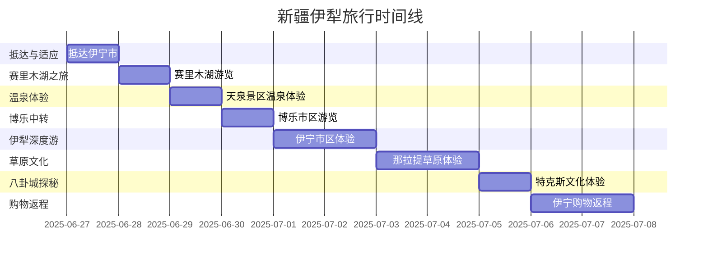
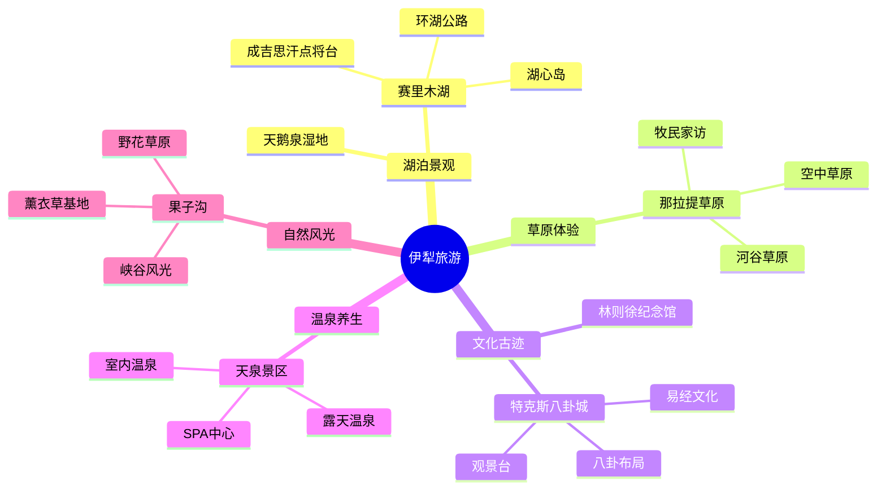
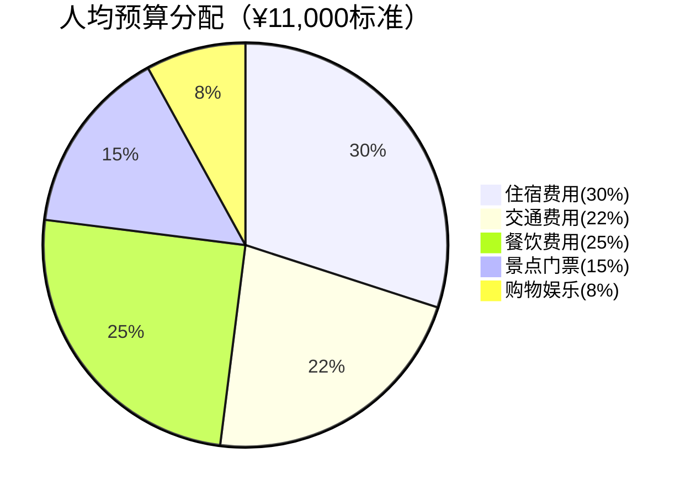
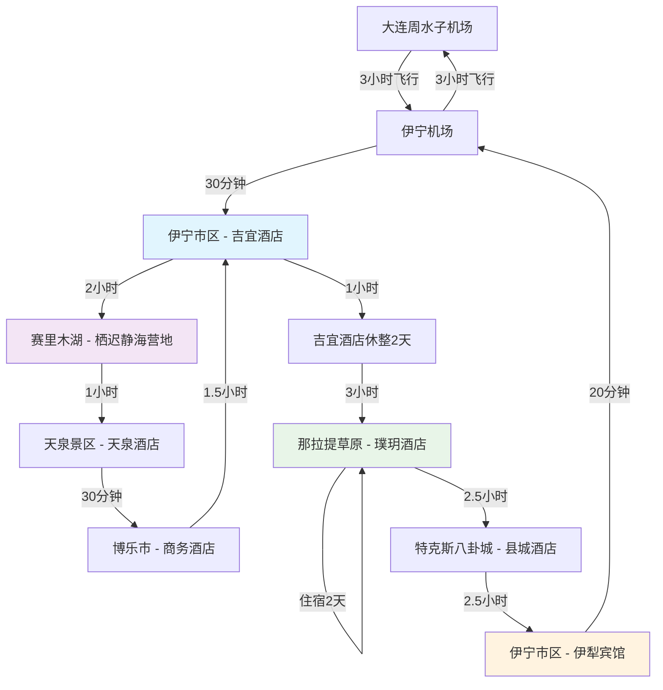

# 新疆伊犁旅游概览

> 📋 **项目说明**：此文件是新疆伊犁深度游旅行攻略的总览文件  
> 🗓️ **创建时间**：2025年6月25日
> ⏱️ **最后更新**：2025年12月19日  
> 👤 **制作人**：Cursor 旅行导游助手  

## 基本信息

| 项目 | 详情 |
|------|------|
| 🗓️ **起始日期** | 2025年6月27日 |
| ⏱️ **总天数** | 11天10夜 |
| 👥 **旅行人数** | 6人团队 |
| 💰 **预算范围** | ¥8,500 - ¥13,500/人（不含往返机票） |
| 🌤️ **最佳旅行季节** | 6月-8月（夏季草原花海盛开） |
| 🚗 **交通方式** | 飞机+自驾租车（2辆SUV） |
| 🏔️ **地理特色** | 天山北麓，伊犁河谷，海拔500-3000米 |
| 🌡️ **气候特点** | 温带大陆性气候，昼夜温差大 |

## 行程概述

### 🌟 行程亮点
- 🏔️ **高山湖泊**：赛里木湖"大西洋最后一滴眼泪"，180°湖景体验
- 🌡️ **温泉养生**：鄂托克塞尔天泉景区温泉，放松身心
- 🌸 **花海盛宴**：伊犁河谷薰衣草和野花海（6月最佳观赏期）
- 🏕️ **草原文化**：那拉提空中草原，体验哈萨克族牧民生活
- 🍯 **美食探索**：新疆特色美食和伊犁本地菜系
- 🏛️ **丝路文化**：感受古丝绸之路的历史韵味
- 🎯 **八卦城奇观**：世界最大八卦城特克斯的神秘布局
- 🛍️ **特产购物**：新疆干果、薰衣草制品、民族工艺品

## 每日行程链接表

| 日期 | 主要行程 | 住宿地 | 详细文件 |
|------|----------|--------|----------|
| 第1天 (6月27日) | 大连→伊宁，机场取车，市区休整 | 吉宜酒店 | [📅 第一天详细行程](./新疆伊犁旅游攻略/2025-06-27-第一天.md) |
| 第2天 (6月28日) | 伊宁→赛里木湖，环湖游览 | 栖迟静海营地 | [📅 第二天详细行程](./新疆伊犁旅游攻略/2025-06-28-第二天.md) |
| 第3天 (6月29日) | 赛里木湖→天泉景区，温泉体验 | 天泉酒店 | [📅 第三天详细行程](./新疆伊犁旅游攻略/2025-06-29-第三天.md) |
| 第4天 (6月30日) | 天泉景区→博乐市，市区游览 | 博乐市酒店 | [📅 第四天详细行程](./新疆伊犁旅游攻略/2025-06-30-第四天.md) |
| 第5天 (7月1日) | 博乐→伊宁，返回伊犁河谷 | 吉宜酒店 | [📅 第五天详细行程](./新疆伊犁旅游攻略/2025-07-01-第五天.md) |
| 第6天 (7月2日) | 伊宁市区深度游，休整放松 | 吉宜酒店 | [📅 第六天详细行程](./新疆伊犁旅游攻略/2025-07-02-第六天.md) |
| 第7天 (7月3日) | 伊宁→那拉提草原，空中草原体验 | 那拉提璞玥酒店 | [📅 第七天详细行程](./新疆伊犁旅游攻略/2025-07-03-第七天.md) |
| 第8天 (7月4日) | 那拉提草原深度游，牧民文化 | 那拉提璞玥酒店 | [📅 第八天详细行程](./新疆伊犁旅游攻略/2025-07-04-第八天.md) |
| 第9天 (7月5日) | 那拉提→特克斯八卦城，探秘之旅 | 全季酒店太极坛店 | [📅 第九天详细行程](./新疆伊犁旅游攻略/2025-07-05-第九天.md) |
| 第10天 (7月6日) | 特克斯→伊宁，市区购物休闲 | 伊犁宾馆 | [📅 第十天详细行程](./新疆伊犁旅游攻略/2025-07-06-第十天.md) |
| 第11天 (7月7日) | 伊宁→大连，还车返程 | 飞机上 | [📅 第十一天详细行程](./新疆伊犁旅游攻略/2025-07-07-第十一天.md) |

## 🏨 住宿安排详情

### 精选住宿体验（6人团队配置）

| 住宿名称 | 入住天数 | 房间配置 | 特色亮点 | 单间价格 | 团队总价 |
|----------|----------|----------|----------|----------|----------|
| **伊宁吉宜酒店** | 4晚 | 3间标准间 | 北京路商圈，地理位置优越，经济型酒店 | ¥258/间 | ¥3,096 |
| **赛里木湖栖迟静海营地** | 1晚 | 3间湖景房 | 湖边木屋，180°湖景，观星胜地 | ¥350/间 | ¥1,050 |
| **天泉国际温泉酒店** | 1晚 | 3间标准间 | 天然温泉，养生度假，山景房 | ¥280/间 | ¥840 |
| **博乐金橡瑞家酒店** | 1晚 | 3间高级房 | 四星商务，金橡大厦，市中心 | ¥350/间 | ¥1,050 |
| **那拉提璞玥酒店** | 2晚 | 3间草原景观房 | 360°草原景观，奢华体验，观星服务 | ¥450/间 | ¥2,700 |
| **全季酒店特克斯太极坛店** | 1晚 | 3间标准间 | 八卦城中心，品牌连锁，太极广场旁 | ¥330/间 | ¥990 |
| **伊宁伊犁宾馆** | 1晚 | 3间标准间 | 四星商务，解放路168号，新疆风情装修 | ¥458/间 | ¥1,374 |

#### 💡 住宿安排建议
- **房间分配**：建议按性别或家庭成员分配房间
- **楼层选择**：尽量选择相邻或同楼层房间，方便团队沟通
- **标准间优势**：性价比最高，设施齐全，适合团队出行
- **特殊需求**：如有特殊住宿需求（连通房、无烟房等）请提前告知

### 🌟 特色住宿推荐理由
- **栖迟静海营地**：赛里木湖唯一湖边住宿，日出日落绝佳观赏点
- **那拉提璞玥酒店**：草原上的奢华体验，专业观星服务
- **伊犁宾馆**：伊宁市历史悠久的四星酒店，解放路168号，新疆文化氛围浓厚
- **博乐金橡瑞家酒店**：博乐市四星商务酒店，金橡大厦标志性建筑，服务优质
- **天泉国际温泉酒店**：天然温泉度假村，拥有20+个室内外温泉池
- **全季酒店特克斯太极坛店**：华住集团品牌连锁，位于八卦城中心，服务标准化

### 📅 每日住宿安排明细表

| 日期 | 行程天数 | 目的地 | 酒店名称 | 酒店等级 | 价格区间 | 特色亮点 | 联系方式 |
|------|----------|--------|----------|----------|----------|----------|----------|
| 6/27 | 第1天 | 伊宁市 | 伊宁吉宜酒店 | 经济型 | ¥258-398 | 北京路商圈，地理位置优越 | 0999-8135222 |
| 6/28 | 第2天 | 赛里木湖 | 栖迟静海营地 | 景观型 | ¥350-500 | 湖景第一排，观星体验 | 景区联系 |
| 6/29 | 第3天 | 温泉县 | 天泉国际温泉酒店 | 度假型 | ¥380-550 | 天然温泉，20+池 | 温泉县联系 |
| 6/30 | 第4天 | 博乐市 | 博乐金橡瑞家酒店 | 四星级 | ¥320-480 | 金橡大厦，市中心商务区 | 0909-2298888 |
| 7/1 | 第5天 | 伊宁市 | 伊宁吉宜酒店 | 经济型 | ¥258-398 | 北京路商圈，地理位置优越 | 0999-8135222 |
| 7/2 | 第6天 | 伊宁市 | 伊宁吉宜酒店 | 经济型 | ¥258-398 | 北京路商圈，地理位置优越 | 0999-8135222 |
| 7/3 | 第7天 | 那拉提 | 那拉提璞玥酒店 | 度假型 | ¥450-600 | 草原全景，观星服务 | 0999-5281688 |
| 7/4 | 第8天 | 那拉提 | 那拉提璞玥酒店 | 度假型 | ¥450-600 | 牧民文化体验 | 0999-5281688 |
| 7/5 | 第9天 | 特克斯县 | 全季酒店特克斯太极坛店 | 商务型 | ¥280-380 | 品牌连锁，太极广场旁 | 0999-3623888 |
| 7/6 | 第10天 | 伊宁市 | 伊宁伊犁宾馆 | 四星级 | ¥388-588 | 历史悠久，解放路168号 | 0999-8012345 |

#### 🏨 酒店预订建议
- **提前预订**：建议提前15-30天预订，确保房源充足
- **团队优惠**：6人团队预订可享受团体价格优惠
- **房型选择**：标准间性价比最高，景观房体验最佳
- **特殊需求**：如需连通房、无烟房等请提前告知
- **入住时间**：一般15:00后入住，12:00前退房
- **押金政策**：多数酒店需要现金或信用卡预授权押金

## 🍽️ 美食文化体验

### 必尝美食清单（6人团队推荐）

| 美食分类 | 代表菜品 | 推荐餐厅 | 人均价格 | 团队总价 | 团队优惠 |
|----------|----------|----------|----------|----------|----------|
| **新疆经典** | 手抓饭、大盘鸡、烤羊肉串 | 伊犁风情园 | ¥120/人 | ¥720 | 6人用餐可享9折优惠 |
| **哈萨克美食** | 熏马肠、马奶酒、手抓肉 | 草原人家 | ¥150/人 | ¥900 | 免费赠送马奶茶 |
| **伊犁特色** | 薰衣草蜂蜜、伊犁苹果、野蘑菇 | 璞玥酒店餐厅 | ¥200/人 | ¥1,200 | 团队预订享优先包房 |
| **湖鲜美味** | 赛里木湖冷水鱼、湖虾 | 湖边餐厅 | ¥160/人 | ¥960 | 团队用餐免包房费 |
| **温泉药膳** | 天山雪莲汤、虫草炖羊肉 | 天泉酒店 | ¥250/人 | ¥1,500 | 住店客人享8.5折 |

#### 🍽️ 团队用餐建议
- **预约制**：建议提前1天预约团队用餐，确保有包房或合适座位
- **菜品搭配**：6人用餐建议点8-10个菜，荤素搭配，照顾不同口味
- **特色体验**：安排1-2次特色用餐体验（牧民家访、湖边野餐）
- **用餐时间**：避开高峰期（12:00-13:00，18:30-19:30）用餐体验更好

### 🥘 特色餐饮体验
- **牧民家访**：体验哈萨克族传统饮食文化
- **湖边野餐**：赛里木湖畔的浪漫用餐
- **草原篝火晚会**：品尝烤全羊，观看民族歌舞

## 🎯 核心景点与体验

### 主要景点分布

### 🎨 摄影打卡点
1. **赛里木湖日出**：最佳拍摄时间06:30-07:30
2. **那拉提空中草原**：360°全景拍摄点
3. **特克斯观景台**：俯瞰八卦城全貌
4. **薰衣草花海**：6月下旬紫色海洋
5. **伊犁河大桥**：城市地标夜景

## 💰 预算概览（6人团队版）

### 📊 详细费用估算（6人团队）

| 费用类别 | 详细项目 | 总费用 | 人均费用 | 备注说明 |
|----------|----------|--------|----------|----------|
| 🚗 **交通费用** | 2辆SUV租车+油费+停车+保险 | ¥13,200-16,800 | ¥2,200-2,800 | 11天租车，平均分摊 |
| 🏨 **住宿费用** | 10晚标准间住宿（3间房） | ¥11,100-14,020 | ¥1,850-2,337 | 标准间为主，3间房 |
| 🍽️ **餐饮费用** | 三餐+特色体验+团队聚餐 | ¥16,200-21,600 | ¥2,700-3,600 | 包含特色餐厅和团餐 |
| 🎫 **景点门票** | 主要景点+体验项目 | ¥9,000-12,600 | ¥1,500-2,100 | 含温泉、骑马、观光车等 |
| 🛍️ **购物娱乐** | 特产+纪念品+娱乐活动 | ¥3,000-6,000 | ¥500-1,000 | 薰衣草制品、干果等 |
| 💰 **其他费用** | 保险+通讯+杂费+小费 | ¥3,000-4,200 | ¥500-700 | 含旅游保险、应急费用 |
| **🎯 总计** | **6人团队11天完整行程** | **¥55,500-75,220** | **¥9,250-12,537** | **不含往返机票** |

### 🚗 交通费用详细分解

| 项目 | 费用明细 | 备注 |
|------|----------|------|
| **车辆租赁** | 2辆中型SUV × 11天 × ¥280/天 = ¥6,160 | 汉兰达/途观L级别 |
| **全险保障** | 2辆车 × 11天 × ¥80/天 = ¥1,760 | 全车险+第三者责任险 |
| **油费** | 约1,200km × 2辆车 × ¥1.8/km = ¥4,320 | 按当前油价估算 |
| **过路费** | 高速费用 = ¥800 | 主要路段过路费 |
| **停车费** | 景区+酒店停车 = ¥960 | 平均¥48/天×2车×10天 |
| **异地还车** | 可能产生费用 = ¥200 | 机场取还车 |
| **小计** | **¥14,200** | **人均¥2,367** |

### 🏨 住宿费用详细分解（标准间为主）

| 住宿地点 | 房间配置 | 单间价格 | 总费用 | 人均费用 |
|----------|----------|----------|--------|----------|
| **伊宁吉康酒店** | 3间标准间×4晚 | ¥258/间 | ¥3,096 | ¥516 |
| **赛里木湖栖迟静海营地** | 3间湖景房×1晚 | ¥350/间 | ¥1,050 | ¥175 |
| **天泉国际温泉酒店** | 3间标准间×1晚 | ¥280/间 | ¥840 | ¥140 |
| **博乐金橡瑞家酒店** | 3间高级房×1晚 | ¥350/间 | ¥1,050 | ¥175 |
| **那拉提璞玥酒店** | 3间草原景观房×2晚 | ¥450/间 | ¥2,700 | ¥450 |
| **全季酒店特克斯太极坛店** | 3间标准间×1晚 | ¥330/间 | ¥990 | ¥165 |
| **伊宁伊犁宾馆** | 3间标准间×1晚 | ¥458/间 | ¥1,374 | ¥229 |
| **小计** | **3间房×10晚** | **平均¥370/间** | **¥11,100** | **¥1,850** |

### 🎫 景点门票费用详细分解

| 景点名称 | 门票价格 | 6人总费用 | 备注 |
|----------|----------|----------|------|
| **赛里木湖** | ¥70/人 | ¥420 | 含环湖观光车¥80/人 = ¥480 |
| **天泉温泉景区** | ¥168/人 | ¥1,008 | 含温泉体验 |
| **那拉提草原** | ¥95/人 | ¥570 | 含景区观光车¥40/人 = ¥240 |
| **那拉提空中草原** | ¥40/人 | ¥240 | 区间车费用 |
| **特克斯八卦城观景台** | ¥30/人 | ¥180 | 俯瞰全城 |
| **林则徐纪念馆** | ¥20/人 | ¥120 | 历史文化景点 |
| **伊犁将军府** | ¥25/人 | ¥150 | 清代建筑 |
| **骑马体验** | ¥150/人×1小时 | ¥900 | 那拉提草原骑马 |
| **篝火晚会** | ¥120/人 | ¥720 | 含烤羊肉串和表演 |
| **其他小景点** | ¥50/人 | ¥300 | 博乐、伊宁市区景点 |
| **小计** | **平均¥185/人×景点** | **¥4,638** | **人均¥773** |

### 🍽️ 餐饮费用详细分解

| 餐饮类型 | 标准 | 6人总费用 | 备注 |
|----------|------|----------|------|
| **早餐** | ¥30/人×11天 | ¥1,980 | 酒店早餐为主 |
| **午餐** | ¥80/人×11天 | ¥5,280 | 特色餐厅+路餐 |
| **晚餐** | ¥120/人×11天 | ¥7,920 | 特色餐厅+团队聚餐 |
| **特色体验餐** | ¥200/人×2次 | ¥2,400 | 牧民家访+湖边野餐 |
| **下午茶/小食** | ¥40/人×5天 | ¥1,200 | 咖啡、奶茶、干果 |
| **小计** | **¥470/人×11天** | **¥18,780** | **人均¥3,130** |

### 💡 省钱小贴士（6人团队专享）
- **住宿优势**：6人可订3间标准间，比单人出行住宿成本降低40%
- **交通分摊**：租车费用6人分摊，人均交通成本大幅降低
- **团队用餐**：6人团队可享受餐厅团体优惠，通常有8-9折优惠
- **景区门票**：部分景区6人以上有团体票优惠，可节省10-15%
- **购物议价**：团体购买特产更有议价空间，批量购买享受优惠
- **车辆选择**：选择2辆中型SUV比豪华车型每天可节省¥200-300
- **住宿预订**：提前30天预订标准间，可享受早鸟价格
- **餐饮搭配**：早餐酒店解决，午餐简餐，晚餐特色餐厅的搭配最经济

### 🎯 团队出行优势分析
- **成本分摊**：固定成本（租车、部分门票）6人分摊，大幅降低人均费用
- **安全保障**：6人团队相互照应，降低旅行风险
- **体验丰富**：可以尝试更多团体活动（篝火晚会、团队骑马等）
- **灵活性强**：两辆车可以分组行动，适应不同兴趣需求

### 📋 6人团队预算总结

| 预算档次 | 人均费用 | 团队总费用 | 住宿标准 | 餐饮标准 | 适合人群 |
|----------|----------|------------|----------|----------|----------|
| **经济型** | ¥8,830-9,830 | ¥52,980-58,980 | 标准间为主 | 以当地餐厅为主 | 预算有限的团队 |
| **舒适型** | ¥10,330-11,830 | ¥61,980-70,980 | 标准间+景观房 | 特色餐厅+体验餐 | 追求性价比的团队 |
| **豪华型** | ¥12,330-13,830 | ¥73,980-82,980 | 景观房+套房 | 高端餐厅+私享体验 | 追求品质的团队 |

#### 💰 费用包含项目
✅ **包含费用**：
- 2辆SUV租车费用（11天）
- 全车险保障
- 10晚住宿费用（3间房）
- 全程油费和停车费
- 景点门票和观光车费
- 特色体验项目费用
- 旅游保险

❌ **不包含费用**：
- 往返大连的机票费用
- 个人购物和额外消费
- 个人旅游意外保险
- 行李超重费用
- 单间差价（如需单独住宿）

#### 🎁 团队专享福利
- **免费升级**：酒店有空房时可能免费升级房型
- **团队优惠**：餐厅和景区的团体折扣
- **专车服务**：2辆车保证团队出行的便利性
- **灵活安排**：可根据团队喜好调整部分行程
- **安全保障**：24小时紧急联系服务

## 🌈 特色体验推荐

### 🌸 最佳观赏时节
| 景观类型 | 最佳时间 | 观赏地点 | 特色描述 |
|----------|----------|----------|----------|
| **薰衣草花海** | 6月下旬-7月上旬 | 伊犁河谷各地 | 紫色海洋，香气怡人 |
| **野花草原** | 6月-7月 | 那拉提、喀拉峻 | 五彩斑斓，层次丰富 |
| **雪山倒影** | 全年（夏季最佳） | 赛里木湖 | 天山雪峰镜像 |
| **草原日出** | 5月-9月 | 那拉提空中草原 | 金色草原，震撼美景 |
| **湖泊日落** | 全年 | 赛里木湖西岸 | 夕阳西下，湖光山色 |

### 🏕️ 独特住宿体验
- **湖边木屋**：赛里木湖栖迟静海营地，与天鹅为邻
- **草原毡房**：那拉提传统蒙古包，体验游牧生活
- **温泉度假**：天泉酒店泡温泉看星空
- **四星商务**：伊犁宾馆感受新疆风情装修

### 🎭 文化体验活动
- **哈萨克族歌舞表演**：那拉提草原篝火晚会
- **传统手工艺制作**：学习民族刺绣和地毯编织
- **马背文化体验**：骑马漫游草原，感受游牧生活
- **易经文化讲座**：特克斯八卦城的神秘布局解读

## 🗺️ 优化路线规划

### 🚗 驾驶路况提醒
- **总里程**：约1,200公里
- **路况等级**：90%国道省道，路况良好
- **加油站分布**：主要城镇均有，建议提前加油
- **限速提醒**：山区路段限速60-80km/h
- **特殊路段**：果子沟大桥（注意限速）、山区弯道（谨慎驾驶）

## ⚠️ 重要注意事项（更新版）

### 📋 出行准备清单
- [ ] **证件类**：身份证、驾驶证、行驶证
- [ ] **预订确认**：机票、酒店、租车确认单
- [ ] **保险类**：旅游保险、车辆保险
- [ ] **健康类**：个人常用药品、防晒用品
- [ ] **电子设备**：充电器、移动电源、相机设备
- [ ] **现金支付**：备用现金（部分地区网络不稳定）

### 🌡️ 着装建议
| 时间段 | 温度范围 | 推荐穿着 | 必备物品 |
|--------|----------|----------|----------|
| **白天** | 20-28°C | T恤+薄外套+防晒帽 | 防晒霜SPF50+ |
| **夜晚** | 5-15°C | 长袖+厚外套/轻羽绒 | 保暖内衣 |
| **高海拔** | 0-20°C | 冲锋衣+保暖层 | 墨镜+润唇膏 |
| **温泉** | 水温42°C | 泳衣+浴袍 | 拖鞋+毛巾 |

### 🏥 健康与安全
- **高原反应**：部分地区海拔2000米以上，携带相关药品
- **紫外线防护**：高原紫外线强烈，做好防晒措施
- **肠胃保护**：注意饮食卫生，避免生冷食物
- **通讯保障**：确保手机电量充足，备用充电宝
- **应急联系**：记录酒店、租车公司、保险公司电话

### 💡 实用技巧
- **最佳拍照时间**：日出后1小时、日落前1小时光线最佳
- **购物议价**：传统市场可适当议价，一般可降价20-30%
- **用餐礼仪**：尊重当地民族习俗，了解基本用餐礼仪
- **语言沟通**：学习几句简单的维吾尔语和哈萨克语问候语

## 📱 数字化便民服务

### 必备APP下载
| 应用类型 | 推荐APP | 主要功能 | 使用场景 |
|----------|---------|----------|----------|
| **地图导航** | 高德地图（离线版） | 导航+路况+景点 | 全程必备 |
| **天气预报** | 中国天气 | 精准天气+穿衣指数 | 出行规划 |
| **翻译工具** | 有道翻译官 | 语音翻译+拍照翻译 | 沟通交流 |
| **美食推荐** | 大众点评 | 餐厅推荐+用户评价 | 觅食指南 |
| **住宿预订** | 携程旅行 | 酒店预订+行程管理 | 临时调整 |
| **支付工具** | 支付宝+微信 | 移动支付+生活服务 | 日常消费 |

### 📞 重要联系方式
| 服务类型 | 联系方式 | 服务时间 | 备注 |
|----------|----------|----------|------|
| **旅游咨询** | 0999-8139777 | 09:00-18:00 | 伊犁州旅游局 |
| **紧急救援** | 110/120/119 | 24小时 | 报警/急救/消防 |
| **道路救援** | 12122 | 24小时 | 高速公路救援 |
| **天气查询** | 12121 | 24小时 | 气象服务热线 |
| **租车服务** | 4008-123-123 | 24小时 | 一嗨租车客服 |

## 🎊 旅行收获预期

### 📸 摄影作品
- **自然风光**：湖泊、草原、雪山、花海系列
- **人文纪实**：民族文化、传统生活、建筑艺术
- **美食记录**：新疆特色菜品、制作过程
- **日常生活**：旅行路上的点点滴滴

### 🎁 纪念收藏
- **特产美食**：和田大枣、新疆葡萄干、薰衣草蜂蜜
- **手工艺品**：民族刺绣、地毯、英吉沙小刀
- **文化纪念**：八卦城文创产品、草原主题纪念品
- **个人定制**：旅行日记、明信片寄给未来的自己

---

## 📚 结语

**温馨提示**：伊犁地区日照时间长（夏季日落约21:30），请合理安排作息时间。6月正值花海盛开季节，是一年中最美的时候。这次旅行将带您深度体验新疆伊犁的自然风光、民族文化和美食特色，留下一生难忘的美好回忆。

**安全提醒**：请随时关注天气变化，遵守当地法律法规，尊重民族习俗，保护生态环境，做一个文明的旅行者。

**联系方式**：如有任何问题或需要调整行程，请随时联系您的专属旅行导游 Cursor 🧳✈️

---

*最后更新时间：2025年12月19日*
*制作人：您的专属旅行导游 Cursor* 

*祝您在新疆伊犁度过一段精彩难忘的旅程！* 🌸🏔️🎉